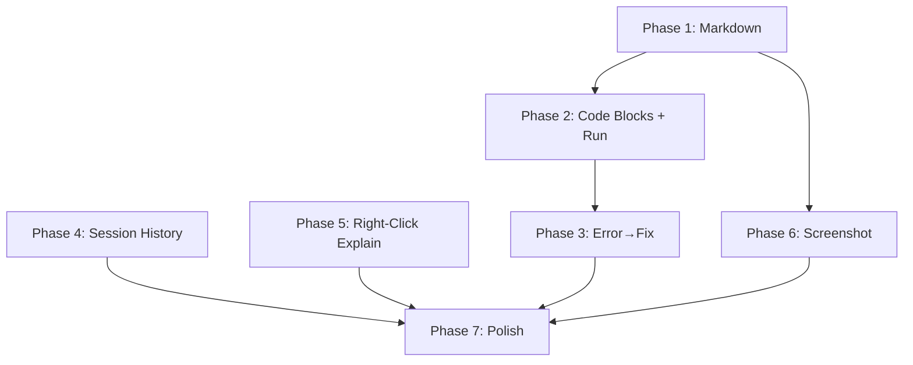

# BFA Coworker — Tier 4b: Competitor UX Analysis & Implementation Plan

**Date**: 2026-08-26
**Status**: Planning — Not Started
**Depends on**: Tier 3e (Chat UI Refinement), existing chat panel (`ui_chat.py`), agent controller, preferences

---

## Table of Contents

1. [Competitor Deep-Dive Analysis](#1-competitor-deep-dive-analysis)
2. [Feature Comparison Matrix](#2-feature-comparison-matrix)
3. [UX Pattern Catalog](#3-ux-pattern-catalog)
4. [Gap Analysis: BFA Coworker vs. Competition](#4-gap-analysis-bfa-coworker-vs-competition)
5. [Implementation Plan](#5-implementation-plan)
6. [Summary of Changes](#6-summary-of-changes)

---

## 1. Competitor Deep-Dive Analysis

### 1.1 Chat Companion (Polygoningenieur)

**Market position**: The veteran. 3+ years old, 44,500+ downloads, 89 ratings at 5/5. The most downloaded AI Blender addon.

**Pricing**: Free tier + $19.90 Full

**Blender support**: 3.3 – 5.0

**UX Architecture**:
- **Chat panel**: N-panel sidebar with input + history
- **Multi-provider**: OpenAI, Google Gemini, Anthropic Claude, LM Studio, Ollama
- **Code execution**: "Run" button on every code block; if it errors, a "Fix" button appears that sends the traceback back to the LLM
- **Code completion**: Inside the Text Editor, can ask for code completion
- **Right-click explain**: On any UI element, right-click → "What's this?" sends context to the LLM
- **Text-to-speech**: Reads answers aloud
- **Attachments**: File attachments supported
- **Output formatting**: Paragraphs, code segments, lists rendered cleanly
- **Copy destinations**: Copy code to new text file, current text file, or clipboard

**Strengths**:
- Deep Blender integration (right-click on UI elements, Text Editor code completion)
- Error→fix loop is a tight feedback cycle
- TTS is unique among competitors
- Mature, battle-tested (3+ years)

**Weaknesses**:
- No tool-calling / agentic capabilities (pure chat + code exec)
- No session history management
- No vision/screenshot support
- Blender 5.0 max (may not work on 5.1+)
- No local-only mode without LM Studio/Ollama

---

### 1.2 Together AI: All-In-One AI Toolbox

**Market position**: Could not fetch details (HTTP 429). Appears to be a newer entrant bundling multiple AI features.

**Note**: Insufficient data for deep analysis. Listed on Superhive as an "All-In-One AI Toolbox."

---

### 1.3 Suzanne AI (trisual)

**Market position**: Early experiment. 3+ years old, only 50+ sales, 1 rating at 1/5. Effectively abandoned.

**Pricing**: $1

**Blender support**: 3.2 – 3.5

**UX Architecture**:
- N-panel chatbot
- OpenAI-only (ChatGPT)
- Conversation stored in a user-selected `.txt` file
- "Try Again" button sends error message back to the LLM
- Very basic — no tool calling, no vision, no code execution safety

**Strengths**:
- Simple, approachable concept
- Conversation persistence via txt file is transparent

**Weaknesses**:
- Effectively abandoned (last updated for Blender 3.5)
- No tool calling, no vision, no local models
- Single-provider (OpenAI)
- No session management
- No code execution safety

---

### 1.4 BlendAI (Ruben Messerschmidt)

**Market position**: The polished commercial offering. 700+ sales, 14,500+ downloads, 14 ratings at 4/5. Most feature-rich non-MCP addon.

**Pricing**: Free tier + $19.95 Pro + $89.99 Enterprise + credit packs ($4.99–$9.99)

**Blender support**: 5.1

**UX Architecture**:

**Chat System**:
- **Dual interface**: Sidebar panel AND popup window (Ctrl+Shift+A)
- **Popup behavior**: Follows cursor during generation (redraws every frame); Esc cancels
- **Input features**: Auto-send on Enter+Shift, auto-reply on Alt
- **File attachments**: txt, xlsx, xls, csv, py, png, jpg, jpeg (max 2 images, 1000 char total input)
- **Quality selector**: Inline in chat input (High/Balanced)
- **Context awareness**: Knows which editor space you're in; knows your modified hotkeys

**Conversation Management**:
- **Chat history**: Search, load, edit name, delete
- **Per-message actions**: Edit (re-populates input), Remove (deletes message+response), Reply (threaded follow-up)
- **Response info**: Generation time, quality settings used
- **New chat**: Creates new empty chat, saves active to history

**Script System**:
- **Generate Script**: Create bpy scripts from natural language
- **Edit Script**: Modify existing scripts
- **Fix Script**: Send error + code back for correction
- **Test Script**: Run and validate
- **Save Script Preset**: Save as reusable preset with name, icon, space filter
- **Preset management**: Search, filter by space, execute, show in context menu, edit name/icon, delete

**Explain Feature**:
- Right-click any UI property/operator/node → "Explain"
- Shift+Explain → answers in popup instead of sidebar
- Can reply to explanations for follow-up

**Generative Features** (out of scope for this analysis but noted):
- Texture Generation, Reference Images, Upscale Image, Inpaint Image
- Render Suggestions

**Preferences**:
- Profile picture and name
- Language (auto-detect or manual)
- Custom instructions (personality — e.g., "Talk to me in Yoda style")
- Quality settings (High/Balanced/Custom per-feature)
- Bring-your-own API keys (OpenAI, Replicate)
- Popup width
- Merge panel with other addons from same author
- Keymap customization
- Auto-update with check-on-startup
- Early access opt-in

**Credit System**:
- Credits consumed per message (1 credit balanced, 5 credits high quality)
- Credit packs: 4000 for $4.99, 10000 for $9.99
- Recharge codes

**Strengths**:
- Most polished chat UX of all competitors
- Dual interface (sidebar + popup) is clever
- Script preset system is unique and powerful
- Right-click Explain is deeply integrated
- Context awareness (space, hotkeys) is thoughtful
- Credit system is transparent
- Custom instructions add personality

**Weaknesses**:
- No tool-calling / agentic capabilities (pure chat + code gen)
- No local model support (OpenAI-only for chat)
- Credit system adds friction
- No vision/screenshot input for chat
- No session persistence across Blender restarts (chat history is in-memory)
- 1000 char input limit is restrictive

---

### 1.5 Blender Buddy (CGMatter) — Free & Local

**Market position**: The local-first free alternative. 4 months old, 6,400+ downloads, 6 ratings at 4/5. Most technically ambitious local-only addon.

**Pricing**: Free

**Blender support**: 5.1

**UX Architecture**:

**Local-First Design**:
- Fully self-contained: downloads and manages llama.cpp + model weights
- Three text model tiers: Low (~9.7 GB), Medium (~14.7 GB, default), High (~21.7 GB)
- Vision model: Qwen3-VL-8B (~5.8 GB) with mmproj
- GPU backend auto-detection: CUDA, Metal, Vulkan, ROCm, CPU
- Pinned llama.cpp release tag for reproducibility
- SHA-256 verification of all downloads
- Resumeable downloads with progress bar
- Legacy model cleanup on upgrade

**Chat Panel UX**:
- **Sidebar in ALL editor types**: 10 space types (VIEW_3D, IMAGE_EDITOR, NODE_EDITOR, SEQUENCE_EDITOR, CLIP_EDITOR, TEXT_EDITOR, GRAPH_EDITOR, DOPESHEET_EDITOR, NLA_EDITOR, SPREADSHEET)
- **Global hotkey**: Ctrl+Shift+Q toggles Buddy sidebar in the editor under cursor
- **Toggle grid**: 2×2 grid of toggles — Web, Action, Deep, Vision
- **Prompt row**: Single-line text input with Enter-to-send
- **Newest-pair-first**: Most recent Q&A at top, history scrolls down
- **Animated icon**: Buddy icon animates during thinking/loading
- **Token counter**: "~X / Yk" estimate in bottom-right

**Message Rendering**:
- **Markdown rendering**: Bold, italic, code, lists, links parsed and displayed
- **Code blocks**: Syntax-highlighted with Run button
- **Safety scanner**: Pre-execution scan for dangerous calls (os.system, subprocess, etc.) and unknown bpy identifiers
- **Trust session**: "Don't ask again this session" checkbox
- **Undo support**: Each Run pushes an undo step
- **Collapse long responses**: 15+ line responses get a collapse toggle
- **Per-message copy**: Icon button on each assistant turn
- **URL extraction**: Clickable link buttons for URLs in responses
- **Revert**: Remove last Q&A pair
- **Clear (Esc)**: Full conversation reset

**Vision/Screenshot**:
- Three capture modes: Select Area (click editor), Full Window, Custom Image
- Area picker: cursor becomes eyedropper, click the editor to capture
- Status bar instructions during pick mode
- Custom image: file path with drag-drop, shows dimensions + size

**Tool System**:
- `search_api`: Lexical search over Blender API index (JSONL)
- `search_web`: DuckDuckGo web search (when online access enabled)
- `fetch_url`: Fetch and read web pages
- `get_scene`: Scene snapshot for context
- `list_info_log`: Recent Blender info-log entries
- Tool-call loop with configurable iterations (15 default, 30 deep mode)
- Fallback regex parsing for tool calls when server doesn't support native tool calling

**Server Management**:
- "Load Buddy" button (first launch loads model ~20-30s)
- "Unload" button in header
- Download progress with cancel
- One-click Preferences setup flow
- Server log access (copy last 400 lines)

**System Prompt**:
- Editable via external text file
- "Reset to Default" button
- Action Mode addendum appended dynamically

**Strengths**:
- Best local-only experience — zero configuration for non-technical users
- Sidebar in every editor type is unique
- Hotkey toggle is well-implemented
- Code safety scanner is best-in-class
- Markdown rendering is polished
- Vision/screenshot with area picker is clever
- Token counter helps users manage context
- Free and fully offline

**Weaknesses**:
- No tool-calling beyond search/fetch (no Blender manipulation tools)
- No session history — conversation is in-memory only, lost on unload
- No multi-turn persistence across Blender sessions
- Single conversation (no session management)
- No agentic capabilities (can't modify the scene)
- Large download (~15 GB for default model)
- Vision model is separate download (~5.8 GB)
- No remote API provider support (local only)

---

### 1.6 BlenderMCP Pro (Anvil Interactive Solutions / Quadify)

**Market position**: The agentic powerhouse. Newest entrant (2 months), 20+ sales, $50. Most technically sophisticated.

**Pricing**: $50 (includes 12 months support + updates)

**Blender support**: 4.2 – 5.2

**UX Architecture**:

**Dual-Mode Architecture**:
- **Built-in chat**: N-panel chat that can call all 75 tools
- **MCP server**: JSON-RPC 2.0 on localhost:7842 for external clients (Claude Desktop, Cursor, Windsurf, Claude.ai Web)
- One-click client config writing
- Cloudflare tunnel for Claude.ai web access
- Quadify Bridge for cross-DCC (UnrealMCP Pro, UnityMCP Pro)

**Agent Teams 2.0**:
- **Planner agent**: Splits goal into dependency-ordered task list
- **Specialist agents**: Layout, Modeling, Materials, Lighting, Rigging, Geometry Nodes, Rendering
- **Validator agent**: Compares final scene against goal, reports concrete problems
- **Auto-fix**: One repair pass before mission reports done
- **Parallel execution**: Independent tasks run concurrently
- **Live task list**: Watch progress, cancel anytime
- **Single undo checkpoint**: One Ctrl+Z rolls back entire mission

**Background Tasks**:
- Queue long jobs, keep working
- Live status, per-job cancel
- Results with cost readout
- Optional multi-agent planner routing

**Chat Panel**:
- Natural language input
- Tool calls shown inline with results
- Viewport screenshot attachment (auto-downscaled to 1280px JPEG)
- Voice input (local Whisper, no API key needed)
- Token optimizer (auto-prunes tool schema, compresses context, summarizes old history)

**Session Management**:
- Auto-titled sessions from first message
- History panel: paginated list with Load, Rename, Favorite, Delete
- New Session button
- Sessions saved locally as individual files
- Auto-reopen last session on Blender start

**Provider System**:
- 5 providers: Claude, Gemini Flash (1M tokens/day free), Groq (free tier), GPT-4o-mini, Ollama (local)
- Auto-fallback: silent switch on rate limit
- Economy/Quality model routing
- Live cost readout per mission/task
- Prompt caching built-in

**Project Memory**:
- Facts and conventions remembered across sessions
- Saved directly on .blend file
- "Remember that this project targets mobile VR — every mesh under 5,000 tris"

**Macros**:
- Save any sequence of AI actions as reusable named tool
- Target object exposed as parameter
- "Run my LOD pipeline on this new prop"

**Scene Co-Pilot**:
- Passive background scan for common issues
- One-click fixes where safe
- Flags: unapplied scale, missing UVs, non-manifold geo

**Render Critic**:
- Structured critique with quality score /10
- 5 focus modes: Full, Lighting, Composition, Materials, Technical
- "Fix with AI" button
- Iterative refinement: render → critique → fix → re-render until target score

**Tool System** (75 tools, 14 categories):
- Scene, Mesh, Material, UV, Export, Render, Pipeline, Light, Object, Python, Asset, Armature, Shader Nodes, Geometry Nodes
- Meshy AI integration (text-to-3D, image-to-3D)
- Auto-discovered addon tools (up to 50 operators from other addons)
- Python sandbox fallback (no file I/O, subprocess, or network)

**Client Connectivity**:
- Recent Tool Calls list with timestamp, tool name, success/failure, execution time
- Source tags: native tools, addon-discovered ("Ext"), Quadify Bridge ("QB")

**Strengths**:
- Most comprehensive tool set (75 tools)
- Agent Teams is the most advanced agentic architecture
- Session management is best-in-class
- Project Memory + Macros create compounding value
- Render Critic with iterative refinement is unique
- Cross-DCC bridge is visionary
- Cost controls are transparent and well-designed
- Provider auto-fallback is robust
- Background tasks enable non-blocking workflows

**Weaknesses**:
- Most expensive ($50)
- Complexity can be overwhelming
- Newer product (2 months), smaller user base
- No right-click explain on UI elements
- No code safety scanner for Python fallback
- No markdown rendering in chat (tool results are plain text)
- No text-to-speech
- No popup/quick-access chat (must open N-panel)

---

## 2. Feature Comparison Matrix

| Feature | Chat Companion | Suzanne AI | BlendAI | Blender Buddy | BlenderMCP Pro | **BFA Coworker** |
|---|---|---|---|---|---|---|
| **Chat Interface** | | | | | | |
| N-panel sidebar | ✅ | ✅ | ✅ | ✅ (10 spaces) | ✅ | ✅ |
| Popup/quick chat | ❌ | ❌ | ✅ (Ctrl+Shift+A) | ✅ (hotkey toggle) | ❌ | ❌ |
| Multi-line input | ? | ? | ✅ | ❌ (single line) | ✅ | ✅ |
| File attachments | ✅ | ❌ | ✅ (8 types) | ✅ (screenshot) | ✅ (screenshot) | ❌ |
| Voice input | ❌ | ❌ | ❌ | ❌ | ✅ (Whisper) | ❌ |
| TTS (read aloud) | ✅ | ❌ | ❌ | ❌ | ❌ | ❌ |
| | | | | | | |
| **Message Display** | | | | | | |
| Markdown rendering | ✅ (basic) | ❌ | ❌ | ✅ (full) | ❌ (plain) | ❌ (plain) |
| Code blocks + Run | ✅ | ✅ (basic) | ✅ | ✅ (+ safety scan) | ✅ (sandbox) | ❌ |
| Collapse long msgs | ❌ | ❌ | ❌ | ✅ (15+ lines) | ❌ | ❌ |
| Per-message copy | ✅ | ❌ | ✅ | ✅ | ? | ✅ |
| URL link buttons | ❌ | ❌ | ❌ | ✅ | ❌ | ❌ |
| Error→fix loop | ✅ | ✅ | ✅ | ❌ | ❌ | ❌ |
| | | | | | | |
| **Conversation Mgmt** | | | | | | |
| Session history | ❌ | ❌ | ✅ (search/load) | ❌ | ✅ (full CRUD) | ✅ (basic) |
| Auto-title sessions | ❌ | ❌ | ❌ | ❌ | ✅ | ❌ |
| Multi-session | ❌ | ❌ | ✅ | ❌ | ✅ | ❌ |
| New/clear thread | ? | ❌ | ✅ | ✅ (Clear/Revert) | ✅ | ✅ |
| Token counter | ❌ | ❌ | ❌ | ✅ | ❌ | ❌ |
| Persist across restart | ❌ | ✅ (txt file) | ❌ | ❌ | ✅ | ✅ |
| | | | | | | |
| **Agentic/Tool System** | | | | | | |
| Tool calling | ❌ | ❌ | ❌ | ✅ (search/fetch) | ✅ (75 tools) | ✅ (MCP tools) |
| Agent teams/planning | ❌ | ❌ | ❌ | ❌ | ✅ (Planner+Specialists) | ❌ |
| Background tasks | ❌ | ❌ | ❌ | ❌ | ✅ | ✅ (queue) |
| Project memory/rules | ❌ | ❌ | ❌ | ❌ | ✅ (.blend) | ✅ (markdown) |
| Macros/reusable tools | ❌ | ❌ | ✅ (script presets) | ❌ | ✅ | ❌ |
| Scene co-pilot | ❌ | ❌ | ❌ | ❌ | ✅ | ❌ |
| Render critic | ❌ | ❌ | ✅ (suggestions) | ❌ | ✅ (iterative) | ❌ |
| | | | | | | |
| **Blender Integration** | | | | | | |
| Right-click explain | ✅ | ❌ | ✅ | ❌ | ❌ | ❌ |
| Context-aware (space) | ❌ | ❌ | ✅ | ❌ | ❌ | ❌ |
| @Mention system | ❌ | ❌ | ❌ | ❌ | ❌ | ✅ |
| Text Editor integration | ✅ (completion) | ❌ | ❌ | ❌ | ❌ | ✅ (sidebar) |
| | | | | | | |
| **Provider/Model** | | | | | | |
| Local models | ✅ (LM Studio/Ollama) | ❌ | ❌ | ✅ (built-in) | ✅ (Ollama) | ✅ (built-in) |
| Remote APIs | ✅ (3 providers) | ✅ (OpenAI) | ✅ (OpenAI) | ❌ | ✅ (4 providers) | ✅ |
| Auto-fallback | ❌ | ❌ | ❌ | ❌ | ✅ | ❌ |
| Cost display | ❌ | ❌ | ✅ (credits) | ❌ | ✅ (live $) | ❌ |
| | | | | | | |
| **Setup Experience** | | | | | | |
| One-click install | ❌ | ❌ | ❌ | ✅ | ✅ | ❌ |
| Auto-download models | ❌ | ❌ | ❌ | ✅ | ❌ | ✅ |
| GPU auto-detect | ❌ | ❌ | ❌ | ✅ | ❌ | ❌ |
| Download progress | ❌ | ❌ | ❌ | ✅ | ❌ | ✅ |
| | | | | | | |
| **MCP/External** | | | | | | |
| MCP server | ❌ | ❌ | ❌ | ❌ | ✅ | ✅ |
| External client config | ❌ | ❌ | ❌ | ❌ | ✅ (one-click) | ❌ |
| Cross-DCC bridge | ❌ | ❌ | ❌ | ❌ | ✅ | ❌ |

### 2.1 BFA Coworker Proposal — After Tier 4b

This table shows what BFA Coworker will look like **after** implementing all Tier 4b phases. The `✅` column is the target state — what we ship.

| Feature | Chat Companion | Suzanne AI | BlendAI | Blender Buddy | BlenderMCP Pro | **BFA Coworker (Now)** | **BFA Coworker (After 4b)** |
|---|---|---|---|---|---|---|---|
| **Chat Interface** | | | | | | | |
| N-panel sidebar | ✅ | ✅ | ✅ | ✅ (10 spaces) | ✅ | ✅ | ✅ |
| Popup/quick chat | ❌ | ❌ | ✅ | ✅ (hotkey) | ❌ | ❌ | ❌ → T5 |
| Multi-line input | ? | ? | ✅ | ❌ | ✅ | ✅ | ✅ |
| File attachments | ✅ | ❌ | ✅ (8 types) | ✅ (screenshot) | ✅ (screenshot) | ❌ | ✅ (screenshot) |
| Voice input | ❌ | ❌ | ❌ | ❌ | ✅ | ❌ | ❌ → T6 |
| TTS (read aloud) | ✅ | ❌ | ❌ | ❌ | ❌ | ❌ | ❌ → T6 |
| | | | | | | | |
| **Message Display** | | | | | | | |
| Markdown rendering | ✅ (basic) | ❌ | ❌ | ✅ (full) | ❌ (plain) | ❌ | ✅ P1 |
| Code blocks + Run | ✅ | ✅ (basic) | ✅ | ✅ (+ safety) | ✅ (sandbox) | ❌ | ✅ P2 |
| Collapse long msgs | ❌ | ❌ | ❌ | ✅ (15+ lines) | ❌ | ❌ | ❌ → post |
| Per-message copy | ✅ | ❌ | ✅ | ✅ | ? | ✅ | ✅ |
| URL link buttons | ❌ | ❌ | ❌ | ✅ | ❌ | ❌ | ✅ (via md) |
| Error→fix loop | ✅ | ✅ | ✅ | ❌ | ❌ | ❌ | ✅ P3 |
| | | | | | | | |
| **Conversation Mgmt** | | | | | | | |
| Session history | ❌ | ❌ | ✅ (search/load) | ❌ | ✅ (full CRUD) | ✅ (basic) | ✅ P4 |
| Auto-title sessions | ❌ | ❌ | ❌ | ❌ | ✅ | ❌ | ✅ P4 |
| Multi-session | ❌ | ❌ | ✅ | ❌ | ✅ | ❌ | ✅ P4 |
| New/clear thread | ? | ❌ | ✅ | ✅ (Clear/Revert) | ✅ | ✅ | ✅ |
| Token counter | ❌ | ❌ | ❌ | ✅ | ❌ | ❌ | ❌ → post |
| Persist across restart | ❌ | ✅ (txt file) | ❌ | ❌ | ✅ | ✅ | ✅ |
| | | | | | | | |
| **Agentic/Tool System** | | | | | | | |
| Tool calling | ❌ | ❌ | ❌ | ✅ (search) | ✅ (75 tools) | ✅ (MCP) | ✅ |
| Agent teams/planning | ❌ | ❌ | ❌ | ❌ | ✅ | ❌ | ❌ → T5/6 |
| Background tasks | ❌ | ❌ | ❌ | ❌ | ✅ | ✅ (queue) | ✅ |
| Project memory/rules | ❌ | ❌ | ❌ | ❌ | ✅ (.blend) | ✅ (md) | ✅ |
| Macros/reusable tools | ❌ | ❌ | ✅ (presets) | ❌ | ✅ | ❌ | ❌ → T5 |
| Scene co-pilot | ❌ | ❌ | ❌ | ❌ | ✅ | ❌ | ❌ → T6 |
| Render critic | ❌ | ❌ | ✅ (suggestions) | ❌ | ✅ (iterative) | ❌ | ❌ → T6 |
| | | | | | | | |
| **Blender Integration** | | | | | | | |
| Right-click explain | ✅ | ❌ | ✅ | ❌ | ❌ | ❌ | ✅ P5 |
| Context-aware (space) | ❌ | ❌ | ✅ | ❌ | ❌ | ❌ | ❌ → post |
| @Mention system | ❌ | ❌ | ❌ | ❌ | ❌ | ✅ | ✅ |
| Text Editor integration | ✅ (completion) | ❌ | ❌ | ❌ | ❌ | ✅ (sidebar) | ✅ (Tier 4c) |
| | | | | | | | |
| **Provider/Model** | | | | | | | |
| Local models | ✅ (LM Studio) | ❌ | ❌ | ✅ (built-in) | ✅ (Ollama) | ✅ (built-in) | ✅ |
| Remote APIs | ✅ (3) | ✅ (OpenAI) | ✅ (OpenAI) | ❌ | ✅ (4) | ✅ | ✅ |
| Auto-fallback | ❌ | ❌ | ❌ | ❌ | ✅ | ❌ | ❌ → T5 |
| Cost display | ❌ | ❌ | ✅ (credits) | ❌ | ✅ (live $) | ❌ | ❌ → T5 |
| | | | | | | | |
| **Setup Experience** | | | | | | | |
| One-click install | ❌ | ❌ | ❌ | ✅ | ✅ | ❌ | ❌ → T5 |
| Auto-download models | ❌ | ❌ | ❌ | ✅ | ❌ | ✅ | ✅ |
| GPU auto-detect | ❌ | ❌ | ❌ | ✅ | ❌ | ❌ | ❌ → T5 |
| Download progress | ❌ | ❌ | ❌ | ✅ | ❌ | ✅ | ✅ |
| | | | | | | | |
| **MCP/External** | | | | | | | |
| MCP server | ❌ | ❌ | ❌ | ❌ | ✅ | ✅ | ✅ |
| External client config | ❌ | ❌ | ❌ | ❌ | ✅ (one-click) | ❌ | ❌ → T5 |
| Cross-DCC bridge | ❌ | ❌ | ❌ | ❌ | ✅ | ❌ | Out of scope |

**Key**: `P1`–`P7` = Tier 4b Phase number. `T5`/`T6` = deferred to that Tier. `post` = post-Tier 4b polish. `→` = not in Tier 4b scope.

**Summary**: After Tier 4b, BFA Coworker closes **all 5 critical gaps** and **4 of 7 important gaps**. The only remaining gaps vs. BlenderMCP Pro are Agent Teams (T5/6), Macros (T5), Scene Co-Pilot (T6), and Render Critic (T6) — all advanced features that most users won't miss in a free tool.

---

## 3. UX Pattern Catalog

This section catalogs the specific UX patterns found across competitors, organized by what they achieve. Each pattern is evaluated for BFA Coworker applicability with a priority icon:

| Icon | Meaning |
|---|---|
| 🔴 | **Critical** — Must implement in Tier 4b. Core to the chat UX. Without this, the chat panel feels incomplete. |
| 🟡 | **High** — Should implement in Tier 4b. Major UX differentiator. Ships in this tier. |
| 🟢 | **Medium** — Nice to have. Ships in Tier 4b if time allows, otherwise Tier 5. |
| ⚪ | **Low / Deferred** — Noted for future. Not in Tier 4b scope. |

---

### 3.1 Input & Prompting Patterns

#### A. Toggle Grid (Blender Buddy) 🟡

A 2×2 grid of toggle buttons next to the input: Web, Action, Deep, Vision. Each toggle changes the behavior of the next message without needing to open settings.

**Source**: Blender Buddy

**Why high**: We already have Agent/Ask mode toggle. Adding Web, Deep, and Vision toggles in a compact grid would give users quick control over message behavior without opening preferences. However, it's an accelerator — the core chat works without it.

**BFA applicability**: Add toggles next to the input row: Web (online access), Deep (extended thinking), Vision (screenshot). Reuses existing preference flags.

**Implementation phase**: Phase 7 (polish)

---

#### B. Popup Chat (BlendAI) ⚪

A floating popup window (Ctrl+Shift+A) that follows the cursor during generation. Allows quick questions without opening the sidebar.

**Source**: BlendAI

**Why deferred**: Useful but adds significant complexity (modal operators, cursor tracking, redraw management). The N-panel is sufficient for Tier 4b. Revisit in Tier 5.

**BFA applicability**: Deferred to Tier 5.

---

#### C. Auto-Send Modifiers (BlendAI) ⚪

Hold Shift+Enter to auto-send, Alt to auto-reply to last message. Reduces clicks for power users.

**Source**: BlendAI

**Why deferred**: Our textbox already supports Enter-to-send. Modifier keys add discoverability issues for minimal gain. Low priority.

**BFA applicability**: Not planned.

---

#### D. Inline Quality Selector (BlendAI) ⚪

A dropdown in the chat input to switch between High/Balanced quality before sending.

**Source**: BlendAI

**Why deferred**: Could map to temperature/model selection, but adds UI clutter. Most users don't change quality per-message. Deferred to Tier 5.

**BFA applicability**: Deferred to Tier 5.

---

#### E. File Attachments (BlendAI, Chat Companion) 🟢

Attach text files, images, spreadsheets to provide context. BlendAI supports 8 file types with a file browser.

**Source**: BlendAI, Chat Companion

**Why medium**: Image attachments (screenshots) are covered by Phase 6. Text/code file attachments are lower priority — users can paste code directly. Nice to have but not critical.

**BFA applicability**: Covered by Phase 6 (screenshot). Text file attachments deferred.

---

### 3.2 Message Display Patterns

#### F. Markdown Rendering (Blender Buddy) 🔴

Parse and render markdown in LLM responses: bold, italic, code blocks, lists, links. Makes responses significantly more readable.

**Source**: Blender Buddy

**Why critical**: Our current plain-text rendering is the single biggest UX gap. Every competitor except BlenderMCP Pro has some form of rich text rendering. LLM responses are naturally markdown-formatted — rendering them as plain text loses structure, readability, and trust.

**BFA applicability**: Direct. Lightweight regex-based parser (no external lib). Support bold, italic, inline code, fenced code blocks, lists, links.

**Implementation phase**: Phase 1

---

#### G. Code Blocks with Run Button (Blender Buddy, Chat Companion) 🔴

Every Python code block gets a "Run" button. Blender Buddy adds a safety scanner that checks for dangerous calls and unknown bpy identifiers before execution.

**Source**: Blender Buddy, Chat Companion, BlendAI

**Why critical**: This is the bridge between "the agent told me what to do" and "the agent did it." Without Run buttons, users must copy-paste code to the Text Editor and run it manually. The safety scanner is essential — AI-generated code can contain hallucinated bpy identifiers or dangerous calls.

**BFA applicability**: Direct. Parse ```python fences, render with Run button, pre-scan for safety, execute in sandboxed namespace with undo support.

**Implementation phase**: Phase 2

---

#### H. Error→Fix Loop (Chat Companion, BlendAI, Suzanne AI) 🔴

When executed code throws an error, a "Fix" button appears that sends the error + code back to the LLM for correction.

**Source**: Chat Companion, BlendAI, Suzanne AI

**Why critical**: This closes the feedback loop. Code execution without error recovery is frustrating — the user has to manually copy the error, paste it into a new message, and ask for a fix. The Fix button automates this into one click.

**BFA applicability**: Direct. Capture traceback from Run execution, display with "Fix with Coworker" button, send as structured prompt.

**Implementation phase**: Phase 3

---

#### I. Collapse Long Responses (Blender Buddy) 🟢

Responses over 15 lines get a collapse/expand toggle. Shows first line + "Show full response (N lines)" or "Collapse" button.

**Source**: Blender Buddy

**Why medium**: Our turn-based layout already provides some collapsing via the turn panel system. Per-message collapse would be a nice refinement but isn't blocking. The turn panel already prevents long responses from dominating the viewport.

**BFA applicability**: Could enhance existing turn panel collapse with per-message collapse. Deferred to post-Tier 4b polish.

---

#### J. URL Link Buttons (Blender Buddy) ⚪

Extract URLs from responses and render them as clickable buttons that open in the OS browser.

**Source**: Blender Buddy

**Why deferred**: Nice-to-have. Covered partially by markdown link rendering (Phase 1). Explicit URL buttons are low priority.

**BFA applicability**: Covered by Phase 1 markdown link support.

---

#### K. Token Usage Counter (Blender Buddy) 🟢

A subtle "~X / Yk" display showing estimated token usage against context window. Helps users know when to clear conversation.

**Source**: Blender Buddy

**Why medium**: Useful for local models with limited context windows. Less critical for remote APIs with large contexts. Would be a helpful addition to the Status panel.

**BFA applicability**: Add to Status & Diagnostics panel. Simple chars/4 heuristic. Deferred to post-Tier 4b polish.

---

### 3.3 Conversation Management Patterns

#### L. Session History with CRUD (BlenderMCP Pro, BlendAI) 🔴

Full session management: auto-titled sessions, search, load, rename, favorite, delete. Sessions persist across Blender restarts.

**Source**: BlenderMCP Pro, BlendAI

**Why critical**: We currently have basic save/load but no session management UI. Users can't browse past conversations, switch between them, or delete old ones. This is a major UX gap — every conversation feels disposable.

**BFA applicability**: Direct. Add `sessions_index.json` metadata file, `BFACW_PT_session_history` panel with paginated list, Load/Rename/Delete operators.

**Implementation phase**: Phase 4

---

#### M. Auto-Title from First Message (BlenderMCP Pro) 🔴

Session title is automatically derived from the user's first message. Eliminates the need to manually name sessions.

**Source**: BlenderMCP Pro

**Why critical**: Manual session naming is friction nobody wants. Auto-titling from the first message (first 60 chars) makes session history browsable without any user effort. This is bundled with Phase 4 — you can't have session history without auto-titling.

**BFA applicability**: Direct. Extract first 60 chars of first user message as session title. Update on save.

**Implementation phase**: Phase 4 (bundled with session history)

---

#### N. Revert Last Pair (Blender Buddy) 🟢

A "Revert" button that removes the last Q&A pair from conversation. Allows quick undo of a bad interaction without full clear.

**Source**: Blender Buddy

**Why medium**: Our "New Thread" clears everything. A softer undo would be useful for recovering from a single bad turn. But it's quality-of-life, not critical.

**BFA applicability**: Add "Revert" button next to "New Thread". Pops last user+assistant pair from history.

**Implementation phase**: Phase 7 (polish)

---

#### O. Per-Message Actions (BlendAI) 🟡

Each message has: Edit (re-populates input), Remove (deletes message+response), Reply (threaded follow-up), Copy, Info (generation time/quality).

**Source**: BlendAI

**Why high**: We already have Copy. Edit and Remove are the two most impactful additions — Edit lets users fix typos without re-typing, Remove lets them delete bad turns. These are small operators with big UX impact.

**BFA applicability**: Add Edit and Remove operators. Edit re-populates the input field. Remove deletes the message pair with confirmation.

**Implementation phase**: Phase 7

---

### 3.4 Agentic & Tool Patterns

#### P. Agent Teams with Planner (BlenderMCP Pro) ⚪

A planner agent decomposes a goal into dependency-ordered tasks. Specialist agents execute tasks in parallel where possible. A validator checks the result.

**Source**: BlenderMCP Pro

**Why deferred**: The most advanced pattern in the competitive landscape. Requires significant architecture changes (multi-agent orchestration, dependency resolution, parallel execution). Tier 5/6 material.

**BFA applicability**: Deferred to Tier 5/6.

---

#### Q. Background Tasks with Queue (BlenderMCP Pro) 🟢

Long-running tasks are queued and run in background. User keeps working. Live status with cancel.

**Source**: BlenderMCP Pro

**Why medium**: We already have a message queue. Extending to background task queue is a natural evolution but not critical for Tier 4b — the message queue already handles the most common case (queueing messages while agent is busy).

**BFA applicability**: Extend existing message queue with task-level tracking. Deferred to Tier 5.

---

#### R. Project Memory (BlenderMCP Pro, BFA Coworker) ✅

Rules and conventions remembered across sessions. BlenderMCP Pro saves on .blend file. We use markdown files.

**Source**: BlenderMCP Pro, BFA Coworker

**Why already have**: Our project rules system is comparable. Markdown files are more portable than .blend-embedded data. Could improve with auto-detection of conventions in future tiers.

**BFA applicability**: Already implemented. Enhancement deferred.

---

#### S. Macros / Script Presets (BlenderMCP Pro, BlendAI) ⚪

Save sequences of actions as reusable named tools. BlendAI's script presets are searchable, filterable by space, and can appear in context menus.

**Source**: BlenderMCP Pro, BlendAI

**Why deferred**: BlendAI's script preset system is the most polished implementation. Valuable for power users but requires a persistence layer and UI that's out of scope for Tier 4b. Tier 5 material.

**BFA applicability**: Deferred to Tier 5.

---

#### T. Scene Co-Pilot (BlenderMCP Pro) ⚪

Passive background scanner that flags common issues (unapplied scale, missing UVs, non-manifold geo) with one-click fixes.

**Source**: BlenderMCP Pro

**Why deferred**: Interesting but complex. Requires background polling, issue detection heuristics, and safe auto-fix logic. Tier 6 material.

**BFA applicability**: Deferred to Tier 6.

---

#### U. Render Critic (BlenderMCP Pro, BlendAI) ⚪

AI critiques a render with structured feedback and quality score. BlenderMCP Pro adds iterative refinement (render→critique→fix→re-render).

**Source**: BlenderMCP Pro, BlendAI

**Why deferred**: Requires vision model support and render pipeline integration. Tier 6 material.

**BFA applicability**: Deferred to Tier 6.

---

### 3.5 Blender Integration Patterns

#### V. Right-Click Explain (Chat Companion, BlendAI) 🔴

Right-click any UI element → "Explain" or "What's this?" sends context to LLM for explanation. BlendAI also supports Shift+click for popup response.

**Source**: Chat Companion, BlendAI

**Why critical**: This is one of the most praised features in both Chat Companion (89 ratings, 5/5) and BlendAI (14 ratings, 4/5). It's the fastest way to get help — no typing, no context-switching. Relatively simple to implement (context menu operator on existing Blender menus).

**BFA applicability**: Direct. Register operator on `WM_MT_button_context_menu`, `NODE_MT_context_menu`, `VIEW3D_MT_object_context_menu`. Capture element identity, send as structured prompt.

**Implementation phase**: Phase 5

---

#### W. Context Awareness (BlendAI) 🟢

The LLM knows which editor space you're in and what your modified hotkeys are. Provides more relevant answers.

**Source**: BlendAI

**Why medium**: We already inject scene context via the agent's scene snapshot. Adding active space and keymap info would make explanations more precise but isn't blocking.

**BFA applicability**: Enhance existing scene context with active editor type and keymap overrides. Deferred to post-Tier 4b polish.

---

#### X. @Mention System (BFA Coworker) ✅

Type @ to search and insert scene item names (objects, materials, collections, etc.).

**Source**: BFA Coworker (unique)

**Why already have**: This is a competitive advantage — no other addon has it. Already implemented and working.

**BFA applicability**: Already implemented.

---

### 3.6 Setup & Onboarding Patterns

#### Y. One-Click Setup Flow (Blender Buddy, BlenderMCP Pro) 🟢

Guided setup that auto-detects hardware, downloads models, and configures everything.

**Source**: Blender Buddy, BlenderMCP Pro

**Why medium**: We already have model download. Blender Buddy's GPU auto-detection and tiered model options are the gold standard. Would improve first-run experience but isn't blocking for Tier 4b.

**BFA applicability**: Enhance existing download flow with GPU detection and model tier recommendations. Deferred to Tier 5.

---

#### Z. Provider Auto-Fallback (BlenderMCP Pro) ⚪

If one provider hits a rate limit, silently switch to the next. Session never breaks.

**Source**: BlenderMCP Pro

**Why deferred**: Nice-to-have but adds complexity. Most users stick to one provider. Tier 5 material.

**BFA applicability**: Deferred to Tier 5.

---

### 3.7 Priority-Ordered Implementation Roadmap

This table shows the top-down evaluation of what to implement, in what order, and why. Each row builds on the ones above it.

| Step | Pattern | Phase | What Changes | Why This Order | User-Visible Result |
|---|---|---|---|---|---|
| **1** | F — Markdown Rendering | 1 | New `_render_markdown()` in `ui_chat.py` | Foundation for all message display. Every other display feature (code blocks, links, lists) depends on markdown parsing. Must come first. | Agent responses render with bold, italic, code, lists, links instead of plain text. |
| **2** | G — Code Blocks + Run | 2 | Parse ```python fences, add Run button, safety scanner | Second foundation. Code blocks are the most common markdown element in agent responses. The Run button is the bridge from "tell me" to "do it." | Python code blocks have a Run button. Safety scanner warns about dangerous calls. |
| **3** | H — Error→Fix Loop | 3 | Capture traceback, display Fix button, send structured prompt | Closes the loop opened by Phase 2. Without this, code execution errors are dead ends. Depends on Phase 2's Run operator existing. | Failed code shows error + "Fix with Coworker" button. One click sends to agent. |
| **4** | L+M — Session History + Auto-Title | 4 | `sessions_index.json`, `BFACW_PT_session_history` panel, Load/Rename/Delete operators | Independent of Phases 1-3. Can be built in parallel. Session management is the biggest missing infrastructure feature. | History panel shows past sessions with auto-titles. Load, rename, delete any session. |
| **5** | V — Right-Click Explain | 5 | `BFACW_OT_explain` operator, context menu registration | Independent of Phases 1-4. Can be built in parallel. High impact, relatively low effort. | Right-click any UI element → "Explain with Coworker" → agent explains it. |
| **6** | E — Screenshot/Vision Input | 6 | Screenshot toggle, area picker, base64 encode, multimodal send | Depends on markdown rendering (Phase 1) for displaying results. Vision is a differentiator — only Blender Buddy and BlenderMCP Pro have it. | Toggle screenshot, click editor to capture, agent sees what you see. |
| **7** | A+N+O — Polish (Toggles, Revert, Per-Message Actions) | 7 | Toggle grid, Revert button, Edit/Remove operators | Ships last. All quality-of-life improvements that depend on the core operators (Phases 1-6) existing. | Toggle grid for quick settings. Revert undoes last turn. Edit/Remove on each message. |

### 3.8 Dependency Graph



**Key**: Phases 1-2-3 form a linear chain (each builds on the previous). Phases 4 and 5 are independent and can be built in parallel with the chain. Phase 6 depends on Phase 1. Phase 7 is the final integration point.

### 3.9 Effort vs. Impact Matrix

| | Low Effort | Medium Effort | High Effort |
|---|---|---|---|
| **High Impact** | V — Right-Click Explain<br>M — Auto-Title Sessions | F — Markdown Rendering<br>L — Session History UI | G — Code Blocks + Run<br>H — Error→Fix Loop |
| **Medium Impact** | N — Revert Last Pair<br>O — Per-Message Actions | E — Screenshot/Vision<br>A — Toggle Grid | |
| **Low Impact** | J — URL Links<br>K — Token Counter | I — Collapse Long Msgs<br>W — Context Awareness | |

**Takeaway**: Phase 5 (Right-Click Explain) is the highest ROI single feature — low effort, high impact. Phase 1 (Markdown) is the highest impact foundation. Phases 2-3 (Code Blocks + Error→Fix) are the most complex but essential for the agentic experience.

---

## 4. Gap Analysis: BFA Coworker vs. Competition

### 4.1 Critical Gaps (Must Fix — Tier 4b) 🔴

| # | Gap | Pattern | Phase | Competitors Who Have It | Impact |
|---|---|---|---|---|---|
| 1 | **Markdown rendering in chat** | F | 1 | Blender Buddy, Chat Companion | Responses are hard to read as plain text |
| 2 | **Code blocks with Run button** | G | 2 | Blender Buddy, Chat Companion, BlendAI | Users must copy-paste code to Text Editor |
| 3 | **Error→Fix loop** | H | 3 | Chat Companion, BlendAI, Suzanne AI | No way to iteratively fix broken code |
| 4 | **Session history UI** | L+M | 4 | BlenderMCP Pro, BlendAI | Can't browse/load past sessions |
| 5 | **Right-click Explain** | V | 5 | Chat Companion, BlendAI | No quick way to ask "what does this button do?" |

### 4.2 Important Gaps (Should Fix — Tier 4b or 5) 🟡

| # | Gap | Pattern | Phase | Competitors Who Have It | Impact |
|---|---|---|---|---|---|
| 6 | **Screenshot/vision input** | E | 6 | Blender Buddy, BlenderMCP Pro | Can't show the agent what you're looking at |
| 7 | **Per-message actions (Edit, Remove)** | O | 7 | BlendAI | Can't edit a sent message or remove a pair |
| 8 | **Toggle grid (Web, Deep, Vision)** | A | 7 | Blender Buddy | Must open preferences to change behavior |
| 9 | **Revert last pair** | N | 7 | Blender Buddy | Must clear entire conversation to undo one turn |
| 10 | **Collapse/expand long messages** | I | — | Blender Buddy | Long responses clutter the panel |
| 11 | **Token usage counter** | K | — | Blender Buddy | No warning before context window fills |
| 12 | **Popup/quick chat** | B | — | BlendAI, Blender Buddy | Must open N-panel to chat |

### 4.3 Nice-to-Have Gaps (Future Tiers) 🚀

These are the features we're deliberately NOT implementing in Tier 4b. They're organized by target tier with rationale for why they belong there.

#### Tier 5 — Power User & Infrastructure (post-4b, ~3-4 weeks)

| # | Gap | Pattern | Source | Effort | Why Tier 5 |
|---|---|---|---|---|---|
| 13 | **Popup/quick chat window** | B | BlendAI | Medium | Requires modal operator + cursor tracking. N-panel is sufficient for now. High value for quick questions. |
| 14 | **Macros / reusable tool sequences** | S | BlendAI, BlenderMCP Pro | High | Requires persistence layer + macro editor UI. BlendAI's script preset system is the reference. |
| 15 | **Background task queue** | Q | BlenderMCP Pro | Medium | Extends existing message queue. We already have queue — this makes it task-level with live status. |
| 16 | **Provider auto-fallback** | Z | BlenderMCP Pro | Medium | Silent switch on rate limit. Most users stick to one provider, but power users with multiple keys benefit. |
| 17 | **GPU auto-detection for local models** | Y | Blender Buddy | Medium | Blender Buddy's GPU detection is the gold standard. Improves first-run experience for local users. |
| 18 | **One-click setup flow** | Y | Blender Buddy | Medium | Bundled with GPU auto-detection. Guided setup that auto-configures everything. |

**Tier 5 delivers**: Quick chat access, reusable automation, robust queue, and smoother onboarding. This is the "power user" tier.

#### Tier 6 — Advanced Intelligence (post-Tier 5, ~4-6 weeks)

| # | Gap | Pattern | Source | Effort | Why Tier 6 |
|---|---|---|---|---|---|
| 19 | **Agent Teams with planner** | P | BlenderMCP Pro | Very High | Multi-agent orchestration, dependency resolution, parallel execution. The most complex feature. |
| 20 | **Scene Co-Pilot (passive issue detection)** | T | BlenderMCP Pro | High | Background polling, issue detection heuristics, safe auto-fix logic. |
| 21 | **Render Critic with iterative refinement** | U | BlenderMCP Pro | High | Requires vision model + render pipeline integration + iterative loop. |
| 22 | **Voice input** | — | BlenderMCP Pro | Medium | Local Whisper integration. No API key needed. |
| 23 | **Text-to-speech output** | — | Chat Companion | Medium | Reads answers aloud. Unique among current competitors. |

**Tier 6 delivers**: Multi-agent orchestration, passive scene monitoring, render feedback loops, and multimodal I/O. This is the "intelligence" tier.

#### Out of Scope

| # | Gap | Source | Why Out of Scope |
|---|---|---|---|
| 24 | **Cross-DCC bridge** | BlenderMCP Pro | BFA-specific. Requires Unreal/Unity integration. Not relevant to our user base. |

### 4.4 BFA Coworker's Unique Advantages

These are capabilities that NO competitor has — they're our moat:

| Advantage | Why It Matters |
|---|---|
| **Full MCP tool system (75+ tools)** | Only BlenderMCP Pro matches this. The agent doesn't just chat — it manipulates the scene. Chat Companion, BlendAI, and Blender Buddy are chat-only. |
| **@Mention system** | Type `@` to insert scene item references. No other addon has this. Makes context injection effortless. |
| **Project rules (markdown files)** | Persistent conventions across sessions. BlenderMCP Pro has this (.blend-embedded), but ours is more portable and editable. |
| **Local + remote LLM** | Works offline with local models AND online with remote APIs. Blender Buddy is local-only. BlendAI is remote-only. We do both. |
| **Message queue** | Queue messages while agent is busy. Only BlenderMCP Pro has background tasks. |
| **Free and open-source** | No $50 license (BlenderMCP Pro). No credit system (BlendAI). No vendor lock-in. |

### 4.5 Competitive Positioning After Tier 4b

After implementing Phases 1-7, BFA Coworker will have:

| Capability | Status |
|---|---|
| Best-in-class agentic tool system (MCP) | ✅ Already have |
| @Mention system | ✅ Already have |
| Project rules | ✅ Already have |
| Message queue | ✅ Already have |
| Local + remote LLM support | ✅ Already have |
| Markdown rendering | ✅ Phase 1 |
| Code blocks + Run + safety scan | ✅ Phase 2 |
| Error→Fix loop | ✅ Phase 3 |
| Session history with auto-title | ✅ Phase 4 |
| Right-click Explain | ✅ Phase 5 |
| Screenshot/vision input | ✅ Phase 6 |
| Per-message Edit/Remove + Revert + Toggle grid | ✅ Phase 7 |

This positions BFA Coworker as the **most complete agentic AI addon for Blender** — combining the best chat UX patterns from BlendAI and Blender Buddy with the agentic capabilities that only BlenderMCP Pro currently offers, all in a free and open-source package.

## 5. Implementation Plan

### Phase 1: Markdown Rendering in Chat (~150 LOC, 1 file)

**What**: Parse and render markdown in LLM responses within the chat panel.

**Reference**: Blender Buddy's `_render_markdown()` function.

**Implementation**:
- Add a lightweight markdown-to-Blender-UI renderer in `ui_chat.py`
- Support: bold (`**text**`), italic (`*text*`), inline code (`` `code` ``), fenced code blocks (` ```python ``` `), unordered lists (`- item`), ordered lists (`1. item`), links (`[text](url)`)
- Code blocks get a distinct visual style (box with monospace-like label)
- Links become clickable (using `wm.url_open`)
- Fall back to plain text for unsupported syntax

**Files modified**: `addon/bfa_coworker/ui_chat.py`

**Verification**:
1. Send a message that produces markdown-formatted response → verify bold, italic, code, lists render correctly
2. Code blocks appear in a distinct box
3. Links are clickable
4. Plain text responses are unaffected

---

### Phase 2: Code Blocks with Run Button (~120 LOC, 2 files)

**What**: Detect Python code blocks in responses and add a "Run" button that executes the code in Blender.

**Reference**: Blender Buddy's `BB_OT_run_code_block` with safety scanner.

**Implementation**:

**Step 2.1 — Code block detection**
- Parse fenced code blocks (`` ```python ... ``` ``) from assistant messages
- Render each block with a "Run" button

**Step 2.2 — Safety scanner**
- Before execution, scan for dangerous calls: `os.system`, `subprocess`, `eval`, `exec`, `__import__`, file I/O
- Scan for unknown bpy identifiers (compare against `dir(bpy.ops)`, `dir(bpy.data)`, etc.)
- Show a confirmation dialog with findings

**Step 2.3 — Execution**
- Execute in a sandboxed namespace with `bpy`, `context`, `D`, `C` in scope
- Push an undo step before execution
- Use `context.temp_override` for 3D Viewport context
- Catch and display errors

**Step 2.4 — Trust session**
- "Don't ask again this session" checkbox in confirmation dialog
- Session-scoped flag that skips confirmation for subsequent runs

**Files modified**:
- `addon/bfa_coworker/ui_chat.py` — code block rendering + Run operator
- `addon/bfa_coworker/agent_controller.py` — optional: code safety scanner utility

**Verification**:
1. Response with Python code block → Run button visible
2. Click Run → confirmation dialog shows safety scan results
3. Safe code executes and modifies scene
4. Dangerous code shows warning in dialog
5. Ctrl+Z undoes the code execution
6. "Don't ask again" skips future confirmations

---

### Phase 3: Error→Fix Loop (~60 LOC, 2 files)

**What**: When executed code throws an error, show a "Fix" button that sends the error + code back to the agent.

**Reference**: Chat Companion's error→fix pattern.

**Implementation**:

**Step 3.1 — Capture execution errors**
- When `BB_OT_run_code_block` catches an exception, store the traceback alongside the code
- Display the error in the chat panel with a "Fix with Coworker" button

**Step 3.2 — Send fix request**
- Clicking "Fix" sends a message to the agent: "The following code produced an error:\n```python\n{code}\n```\nError:\n{traceback}\n\nPlease fix it."
- The agent's response replaces the error display

**Files modified**:
- `addon/bfa_coworker/ui_chat.py` — error display + Fix button
- `addon/bfa_coworker/agent_controller.py` — optional: structured fix request

**Verification**:
1. Run code that produces an error → error displayed with Fix button
2. Click Fix → agent receives error context
3. Agent responds with corrected code
4. New code block has Run button

---

### Phase 4: Session History UI (~200 LOC, 2 files)

**What**: A session management panel that lets users browse, load, rename, and delete past sessions.

**Reference**: BlenderMCP Pro's History panel + BlendAI's Chat History.

**Implementation**:

**Step 4.1 — Session metadata storage**
- Add a `sessions_index.json` file that maps session IDs to metadata (title, created date, message count, last active)
- Auto-title sessions from the first user message (first 60 chars)
- Update metadata on each save

**Step 4.2 — Session History panel**
- New panel: `BFACW_PT_session_history` (collapsible, below chat)
- Paginated list of sessions (most recent first)
- Each entry shows: auto-title, date, message count
- Actions: Load, Rename, Delete (with confirmation)
- "New Session" button to start fresh without losing current

**Step 4.3 — Session switching**
- Loading a session replaces current conversation history
- Current session is auto-saved before switching
- Visual indicator of which session is active

**Files modified**:
- `addon/bfa_coworker/ui_chat.py` — session history panel + operators
- `addon/bfa_coworker/agent_controller.py` — session metadata helpers

**Verification**:
1. Send messages → session auto-titled from first message
2. Click New Session → current session saved, new empty session active
3. Open History panel → see list of past sessions
4. Load a past session → conversation restored
5. Rename a session → new title persists
6. Delete a session → removed from list and disk

---

### Phase 5: Right-Click Explain (~100 LOC, 2 files)

**What**: Right-click any UI element (operator button, property, node) and select "Explain with Coworker" to get an AI explanation.

**Reference**: BlendAI's Explain feature + Chat Companion's "What's this?".

**Implementation**:

**Step 5.1 — Context menu operator**
- Add `BFACW_OT_explain` operator that can be invoked from context menus
- Captures: operator name, property path, node type/name, current editor space
- Sends a structured prompt: "Explain what the '{name}' {type} does in Blender. What is it used for? What are the key settings?"

**Step 5.2 — Registration on context menus**
- Register the operator on relevant context menus:
  - `WM_MT_button_context_menu` (property buttons)
  - `NODE_MT_context_menu` (nodes)
  - `VIEW3D_MT_object_context_menu` (3D view)
- Use poll to only show when Coworker is running

**Step 5.3 — Response display**
- Response appears in the chat panel as a new turn
- If chat panel is closed, open it (or show in popup — Phase 2)

**Files modified**:
- `addon/bfa_coworker/ui_chat.py` — Explain operator
- `addon/bfa_coworker/operators_agent.py` or new file — context menu registration

**Verification**:
1. Right-click a property in the Properties panel → "Explain with Coworker" appears
2. Click it → agent receives explanation request
3. Response appears in chat panel
4. Right-click a node → "Explain with Coworker" appears
5. Works for operators, properties, and nodes

---

### Phase 6: Screenshot/Vision Input (~150 LOC, 2 files)

**What**: Attach a viewport screenshot to a chat message so the agent can see what you're looking at.

**Reference**: Blender Buddy's screenshot system + BlenderMCP Pro's viewport capture.

**Implementation**:

**Step 6.1 — Screenshot capture**
- Add a "📷" toggle button next to the chat input
- Three capture modes (like Blender Buddy):
  - **Area**: Click an editor to capture (eyedropper cursor)
  - **Window**: Capture full Blender window
  - **Viewport**: Capture just the 3D Viewport
- Auto-downscale to max 1280px width, compress to JPEG

**Step 6.2 — Send with message**
- When screenshot toggle is on, capture before sending
- Encode as base64 data URL
- Send as multimodal content (requires vision-capable provider)
- If provider doesn't support vision, show warning

**Step 6.3 — Provider compatibility**
- Check if configured provider supports vision (Claude, Gemini, GPT-4o, GPT-4o-mini)
- Local models: check if vision model is available
- Show clear error if vision isn't supported

**Files modified**:
- `addon/bfa_coworker/ui_chat.py` — screenshot toggle + capture UI
- `addon/bfa_coworker/agent_controller.py` — multimodal message support

**Verification**:
1. Enable screenshot toggle → cursor changes to eyedropper
2. Click an editor → screenshot captured
3. Send message → agent receives image + text
4. Agent responds with image-aware answer
5. Non-vision provider → clear error message

---

### Phase 7: Per-Message Actions & Polish (~80 LOC, 1 file)

**What**: Add Edit and Remove buttons to each user message, and improve the overall message action bar.

**Reference**: BlendAI's per-message actions.

**Implementation**:

**Step 7.1 — Edit message**
- "Edit" button on user messages that re-populates the input field
- Preserves any attachments/screenshot

**Step 7.2 — Remove message pair**
- "Remove" button that deletes the user message + assistant response
- Confirmation dialog to prevent accidents

**Step 7.3 — Improved action bar**
- Consistent icon-only buttons: Copy, Edit, Remove
- Tooltips explain each action

**Files modified**: `addon/bfa_coworker/ui_chat.py`

**Verification**:
1. Click Edit on a user message → input field populated with message text
2. Click Remove → confirmation dialog → message pair deleted
3. All action buttons have clear tooltips

---

## 6. Summary of Changes

| Phase | Pattern | Feature | Files Changed | LOC | Priority |
|---|---|---|---|---|---|
| 1 | F | Markdown rendering | 1 | ~150 | 🔴 CRITICAL |
| 2 | G | Code blocks + Run button | 2 | ~120 | 🔴 CRITICAL |
| 3 | H | Error→Fix loop | 2 | ~60 | 🔴 CRITICAL |
| 4 | L+M | Session history UI + auto-title | 2 | ~200 | 🔴 CRITICAL |
| 5 | V | Right-click Explain | 2 | ~100 | 🔴 CRITICAL |
| 6 | E | Screenshot/Vision input | 2 | ~150 | 🟡 HIGH |
| 7 | A+N+O | Toggle grid + Revert + Per-message actions | 1 | ~80 | 🟡 HIGH |
| **Total** | | | **3-4** | **~860** | |

### Files Modified

| File | Phases |
|---|---|
| `addon/bfa_coworker/ui_chat.py` | 1, 2, 3, 4, 5, 6, 7 |
| `addon/bfa_coworker/agent_controller.py` | 2, 3, 4, 6 |
| `addon/bfa_coworker/operators_agent.py` (or new) | 5 |

### Key Design Decisions

| Decision | Rationale |
|---|---|
| **Lightweight markdown (no external lib)** | Blender's Python environment is constrained. A simple regex-based parser covers 90% of LLM output patterns without dependencies. |
| **Safety scanner before code execution** | Blender Buddy's scanner pattern is proven. Catches dangerous calls AND hallucinated bpy identifiers before they cause errors. |
| **Session auto-title from first message** | BlenderMCP Pro's approach. Eliminates manual naming friction. |
| **Right-click Explain on existing menus** | BlendAI's approach. Leverages Blender's built-in context menu system rather than custom UI. |
| **Screenshot with area picker** | Blender Buddy's approach. More flexible than full-window-only capture. |
| **Error→Fix as structured prompt** | Chat Companion's approach. Sends code + traceback as a new turn rather than requiring special API. |

### What We're NOT Doing (Yet)

These patterns are noted but deferred to future tiers. Each has a concrete implementation plan in the target tier's document.

| Pattern | Source | Target Tier | Phase | Plan Document |
|---|---|---|---|---|
| **Popup/quick chat window** | BlendAI, Blender Buddy | Tier 5 | 5f.1 | `plan_tier5_generative_local_systems.md` |
| **Macros / reusable tool sequences** | BlendAI, BlenderMCP Pro | Tier 5 | 5f.2 | `plan_tier5_generative_local_systems.md` |
| **Background task queue** | BlenderMCP Pro | Tier 5 | 5f.3 | `plan_tier5_generative_local_systems.md` |
| **Provider auto-fallback** | BlenderMCP Pro | Tier 5 | 5f.4 | `plan_tier5_generative_local_systems.md` |
| **GPU auto-detection + one-click setup** | Blender Buddy | Tier 5 | 5f.5 | `plan_tier5_generative_local_systems.md` |
| **Agent Teams with planner** | BlenderMCP Pro | Tier 6 | 6f.1 | `plan_tier6_domain_tooling.md` |
| **Scene Co-Pilot** | BlenderMCP Pro | Tier 6 | 6f.2 | `plan_tier6_domain_tooling.md` |
| **Render Critic with iterative refinement** | BlenderMCP Pro, BlendAI | Tier 6 | 6f.3 | `plan_tier6_domain_tooling.md` |
| **Voice input** | BlenderMCP Pro | Tier 6 | 6f.4 | `plan_tier6_domain_tooling.md` |
| **Text-to-speech output** | Chat Companion | Tier 6 | 6f.5 | `plan_tier6_domain_tooling.md` |
| **External client config (one-click)** | BlenderMCP Pro | Tier 6 | 6f.6 | `plan_tier6_domain_tooling.md` |
| **Cross-DCC bridge** | BlenderMCP Pro | Out of scope | — | BFA-specific, not relevant |

### Competitive Positioning After Tier 4b

After implementing Phases 1-7, BFA Coworker will have:

| Capability | Status |
|---|---|
| Best-in-class agentic tool system (MCP) | ✅ Already have |
| @Mention system | ✅ Already have |
| Project rules | ✅ Already have |
| Message queue | ✅ Already have |
| Local + remote LLM support | ✅ Already have |
| Markdown rendering | ✅ Phase 1 |
| Code blocks + Run + safety scan | ✅ Phase 2 |
| Error→Fix loop | ✅ Phase 3 |
| Session history with auto-title | ✅ Phase 4 |
| Right-click Explain | ✅ Phase 5 |
| Screenshot/vision input | ✅ Phase 6 |
| Toggle grid + Revert + Per-message Edit/Remove | ✅ Phase 7 |

This positions BFA Coworker as the **most complete agentic AI addon for Blender** — combining the best chat UX patterns from BlendAI and Blender Buddy with the agentic capabilities that only BlenderMCP Pro currently offers, all in a free and open-source package.