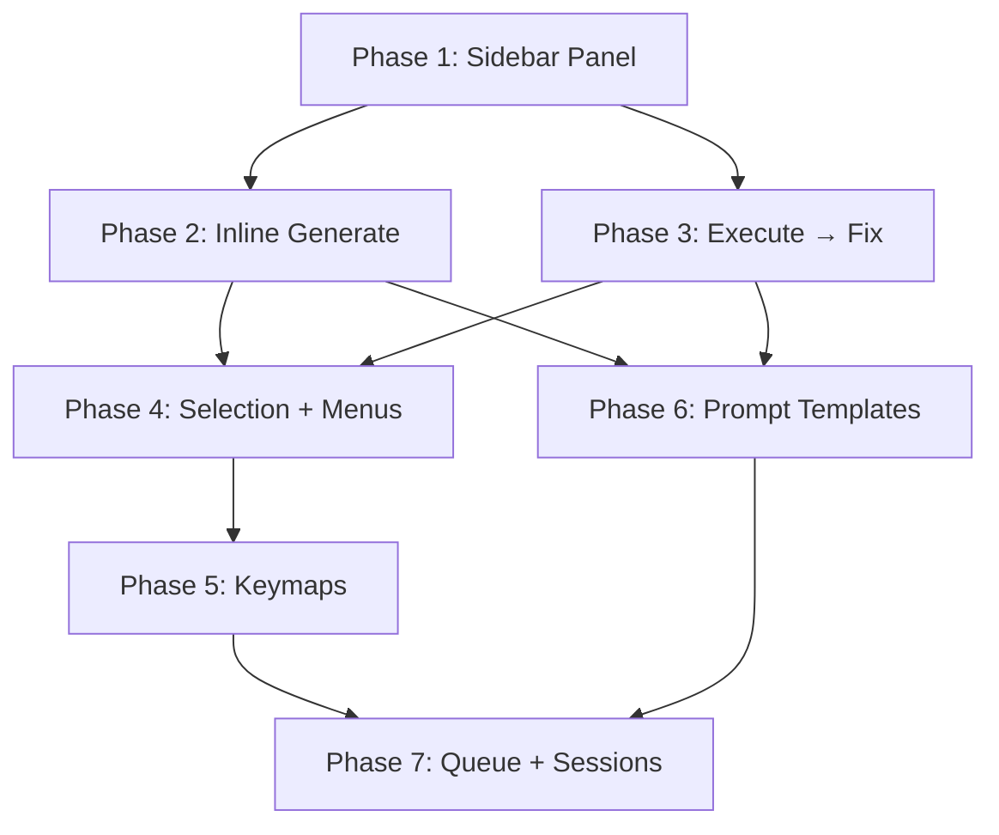

# BFA Coworker — Tier 4c: Text Editor as IDE-Agent Code Workspace

**Date**: 2026-08-26
**Status**: Planning — Not Started
**Depends on**: Tier 3e (Chat UI Refinement), Tier 4b (Competitor UX), existing Text Editor panel (`ui_chat.py`), agent controller

**Reference Issue**: [#52 — Include coding agent short-hand tooling into Text Editor](https://github.com/Draise14/bfa_coworker/issues/52)

**Reference Implementation**: [jer-nc/blender_deepseek_ai](https://github.com/jer-nc/blender_deepseek_ai) — DeepSeek AI Autocomplete for Blender Text Editor

---

## Table of Contents

1. [Current State Analysis](#1-current-state-analysis)
2. [Deepseek AI Addon Deep-Dive](#2-deepseek-ai-addon-deep-dive)
3. [UX Pattern Extraction](#3-ux-pattern-extraction)
4. [Gap Analysis: BFA Coworker Text Editor vs. IDE Agents](#4-gap-analysis)
5. [Implementation Plan](#5-implementation-plan)
6. [Summary of Changes](#6-summary-of-changes)

---

## 1. Current State Analysis

### 1.1 What We Have Now

The current `BFACW_PT_chat_text_editor` panel is a **near-identical copy** of the main 3D Viewport chat panel. It shows:

- Start/Stop buttons
- Agent/Ask mode toggle
- Project Rules button
- Chat input textbox
- Send/New Thread buttons
- Conversation history summary (last 10 messages)

**Problems:**
1. **Redundant** — it's the same chat interface duplicated in a different editor. No Text-Editor-specific value.
2. **Not contextual** — doesn't use the active text datablock, cursor position, or selected text at all.
3. **No inline editing** — the agent's code output goes to the chat panel, not into the text editor.
4. **No code-specific tooling** — no autocomplete, no error fixing, no code generation into the editor.
5. **Wasted opportunity** — the Text Editor is where users write bpy scripts, yet the agent has zero awareness of it.

### 1.2 Existing Infrastructure We Can Leverage

| Component | Location | What It Does |
|---|---|---|
| `_save_code_to_text_editor_deferred()` | `agent_controller.py:2764` | Saves agent-generated code to `Coworker_*` text datablocks |
| `_clear_coworker_text_blocks()` | `agent_controller.py:2749` | Cleans up `Coworker_*` text blocks |
| `export_session_log()` | `agent_controller.py:2799` | Exports session to `Coworker_Session_*` text block |
| `BFACW_PT_chat_text_editor` | `ui_chat.py:1703` | Current Text Editor sidebar panel |
| `BFACW_OT_edit_rules` | `ui_chat.py` | Opens project rules in Text Editor |
| Full MCP tool system | `agent_controller.py` | 75+ tools the agent can call |
| Message queue | `agent_controller.py` | Queue system for async message processing |
| @Mention system | `ui_chat.py` | Scene item search and insertion |

---

## 2. Deepseek AI Addon Deep-Dive

### 2.1 Architecture Overview

The `blender_deepseek_ai` addon is a focused, single-purpose Text Editor AI assistant. It has exactly **two operators** and **one preferences class** — minimal and effective.

```
source/
├── __init__.py          # Registration, preferences, menu, keymaps
├── config.py            # Default constants (API URL, model, prompts, params)
├── properties.py        # DeepSeekProperties mixin class
└── operators/
    ├── autocomplete.py  # DEEPSEEK_OT_AutoComplete (Ctrl+Space)
    └── fix_errors.py    # DEEPSEEK_OT_FixErrors (F8)
```

### 2.2 Operator: Autocomplete (`Ctrl+Space`)

**Flow:**
```
User presses Ctrl+Space
  → invoke() captures code context + scene context
  → Formats prompt with {code_context} and {scene_context}
  → Spawns thread for streaming API call
  → Starts modal timer (0.1s interval)
  → modal() reads from thread-safe Queue
  → On each token: replaces text block content in real-time
  → Shows reasoning as # comments, then code
  → On 'done': cleanup, final text block write
```

**Key implementation details:**

```python
# Code context: everything before cursor
def get_code_context(self, context):
    text_block = context.space_data.text
    current_line_index = text_block.current_line_index
    cursor_idx = text_block.current_character
    
    full_context = []
    for line in text_block.lines[:current_line_index]:
        full_context.append(line.body)
    
    if text_block.lines:
        current_line = text_block.lines[current_line_index].body
        full_context.append(current_line[:cursor_idx])
    
    return '\n'.join(full_context)
```

```python
# Scene context: Blender version, scene info, selected objects, cameras, lights, meshes, render settings
def get_scene_context(self, context):
    scene = context.scene
    scene_info = []
    scene_info.append(f"Blender Version: {bpy.app.version_string}")
    scene_info.append(f"\nScene Name: {scene.name}")
    scene_info.append(f"Total Objects: {len(scene.objects)}")
    # ... cameras, lights, meshes, render settings ...
    return '\n'.join(scene_info)
```

```python
# Streaming: real-time text block replacement
def modal(self, context, event):
    if event.type == 'TIMER':
        while not self.data_queue.empty():
            data_type, data = self.data_queue.get()
            text_block = context.space_data.text
            full_text = self.original_text + "\n\n"
            
            if self.reasoning_buffer:
                reasoning_lines = self.reasoning_buffer.split('\n')
                commented_reasoning = '\n'.join([
                    f"# {line}" if not line.startswith('#') else line 
                    for line in reasoning_lines if line.strip()
                ])
                full_text += "# [Reasoning Process]:\n" + commented_reasoning + "\n\n"
            
            if self.response_buffer:
                full_text += "# Code:\n" + self.response_buffer
            
            cleaned_text = self.clean_response(full_text)
            text_block.from_string(cleaned_text)
            text_block.current_line_index = len(text_block.lines) - 1
```

**Prompt template (configurable):**
```
Continue the Blender Python code STRICTLY FOLLOWING:
1. ONLY valid Python code WITHOUT markdown
2. Use # comments ONLY for brief technical notes
3. Maintain the existing code style
4. Respond EXCLUSIVELY with the new necessary code

5. Feel free to completely REWRITE the code if the user's request requires a different approach

Current context:
'''
{code_context}
'''

'''
{scene_context}
'''

New request:
```

### 2.3 Operator: Fix Errors (`F8`)

**Flow:**
```
User presses F8
  → execute_code() runs the current text block in a sandbox
  → Captures stdout, stderr, and traceback
  → If error: sends code + error + traceback to API
  → API returns corrected code
  → Replaces text block with corrected code
  → If no error: reports "No errors detected"
```

**Key implementation details:**

```python
def execute_code(self, context):
    text_block = context.space_data.text
    code = text_block.as_string()
    
    old_stdout, old_stderr = sys.stdout, sys.stderr
    output_buffer = io.StringIO()
    sys.stdout = sys.stderr = output_buffer
    
    try:
        namespace = {'__name__': '__main__', 'bpy': bpy}
        exec(code, namespace)
        error_occurred = False
    except Exception as e:
        error_occurred = True
        traceback.print_exc(file=output_buffer)
        self.error_data = {
            "message": str(e),
            "traceback": output_buffer.getvalue(),
            "code": code
        }
    finally:
        sys.stdout, sys.stderr = old_stdout, old_stderr
        output_buffer.close()
    
    return error_occurred
```

**Error prompt template (configurable):**
```
Fix this Blender Python code based on the error:
Error: {error}
Console output:
'''
{console_output}
'''
Original code:
'''
{code}
'''
Instructions:
1. Provide ONLY the corrected code
2. Add comments ONLY to the corrected lines of code
3. Maintain the original code style
```

### 2.4 Registration & Keymaps

```python
# Right-click menu integration
def menu_draw(self, context):
    self.layout.operator(DEEPSEEK_OT_AutoComplete.bl_idname)
    self.layout.operator(DEEPSEEK_OT_FixErrors.bl_idname)

bpy.types.TEXT_MT_editor_menus.append(menu_draw)

# Keyboard shortcuts
# Ctrl+Space → Autocomplete
# F8 → Fix Errors
```

### 2.5 What Makes It Good

| Pattern | Why It Works |
|---|---|
| **Inline editing** | Code goes directly into the text block, not a separate chat panel. The Text Editor IS the interface. |
| **Streaming real-time** | Users see code appear token-by-token. Feels responsive and magical. |
| **Context-aware** | Only sends code before cursor + scene context. Not the whole file. Efficient. |
| **Keyboard shortcuts** | Ctrl+Space and F8 are muscle-memory for IDE users. No mouse needed. |
| **Right-click menu** | Discoverable for new users. Operators appear in the existing Text Editor context menu. |
| **Prompt templates** | User-configurable. Power users can tune the behavior. |
| **Reasoning as comments** | AI's thinking process is preserved as `# [Reasoning Process]:` comments. Transparent and reviewable. |
| **Minimal scope** | Only 2 operators. Does one thing well. No feature bloat. |

### 2.6 What It's Missing (Opportunities for BFA Coworker)

| Gap | How BFA Coworker Can Fill It |
|---|---|
| **No tool calling** | BFA has 75+ MCP tools. The agent can manipulate the scene while writing code. |
| **No multi-turn conversation** | Single-shot only. BFA can maintain conversation context across edits. |
| **No project rules** | BFA has project rules that persist across sessions. |
| **No session history** | BFA can save/load coding sessions. |
| **No @mentions** | BFA can insert scene item references. |
| **No local models** | BFA supports local LLMs. |
| **No queue** | BFA can queue code generation tasks. |
| **Single provider** | DeepSeek only. BFA supports multiple providers. |
| **No selection-aware editing** | Only cursor-position aware. BFA can use selected text as context. |
| **No "Edit with Coworker" on selection** | BFA can add right-click "Edit with Coworker" that sends selected text + instruction. |

---

## 3. UX Pattern Extraction

From the Deepseek AI addon and modern IDE agents (Cursor, Copilot, Windsurf), we extract these patterns. Each is evaluated for BFA Coworker applicability with a priority icon:

| Icon | Meaning |
|---|---|
| 🔴 | **Critical** — Must implement. Core to the Text Editor agent experience. Without this, the feature doesn't work. |
| 🟡 | **High** — Should implement. Major UX differentiator. Ships in Tier 4c. |
| 🟢 | **Medium** — Nice to have. Ships in Tier 4c if time allows, otherwise Tier 5. |
| ⚪ | **Low / Deferred** — Noted for future. Not in Tier 4c scope. |

---

### Pattern A: Inline Code Generation 🔴

**What**: The AI writes directly into the text datablock. The Text Editor is both input and output surface.

**Source**: Deepseek AI, Cursor, Copilot, Windsurf

**Why critical**: This is the defining feature of an IDE agent. Without inline editing, the Text Editor panel is just a redundant chat interface. The user's mental model is "I'm editing code in my editor, and the AI helps me write it *right here*."

**BFA applicability**: Direct. We already have `_save_code_to_text_editor_deferred()` that writes to `Coworker_*` blocks. We need to redirect that output into the *active* text block at the cursor position instead.

**Implementation phase**: Phase 2

---

### Pattern B: Cursor-Position Context 🔴

**What**: Only code before the cursor is sent as context. Not the whole file. Efficient and follows the user's mental model ("continue from here").

**Source**: Deepseek AI, Cursor, Copilot

**Why critical**: Sending the entire file wastes tokens and dilutes the signal. The cursor position tells the AI exactly where the user wants help. Combined with Pattern A, this creates the "tab completion on steroids" feel.

**BFA applicability**: Direct. `text_block.current_line_index` and `text_block.current_character` give us the cursor position. We iterate `text_block.lines[:current_line]` to get context.

**Implementation phase**: Phase 2

---

### Pattern C: Selection-Aware Editing 🔴

**What**: Selected text becomes the target of the operation. "Edit this function to handle edge cases" or "Explain this block" — the selection IS the context.

**Source**: Cursor, Copilot, Windsurf (Deepseek AI does NOT have this)

**Why critical**: This is the bridge between "generate from scratch" and "modify existing code." Artists working on pipeline scripts rarely start from nothing — they have existing code that needs modification. Selection-aware editing is how they communicate *what* to change.

**BFA applicability**: Direct. Blender's Text Editor has selection state via `text_block.select_end_line_index` and `text_block.current_line_index`. We extract the selected lines and use them as the `{selection}` placeholder.

**Implementation phase**: Phase 4

---

### Pattern D: Streaming Real-Time Updates 🔴

**What**: Code appears token-by-token in the editor. Uses a modal timer (0.1s) + thread-safe `Queue` pattern. The user watches the AI "type" the code.

**Source**: Deepseek AI, Cursor, Copilot

**Why critical**: Streaming is what makes the experience feel like magic rather than a loading spinner. It also lets the user cancel mid-generation if the AI is going in the wrong direction. The modal timer pattern is battle-tested in Blender (used by Deepseek AI, Blender Buddy, and our own chat panel).

**BFA applicability**: Direct. We already have streaming callbacks (`on_text`, `on_reasoning`) in `run_conversation_turn()`. We hook those into a `Queue` and read from it in the modal timer.

**Implementation phase**: Phase 2

---

### Pattern E: Execute → Error → Fix Loop 🔴

**What**: Run the code, capture stdout/stderr/traceback, send to AI for correction, replace in editor. Tight feedback cycle. If no error, report success.

**Source**: Deepseek AI, Cursor (debugger integration), Copilot

**Why critical**: This closes the loop. Code generation without execution feedback is guesswork. The execute→fix cycle turns the Text Editor into a REPL-like environment where the AI learns from runtime errors. For pipeline scripting, this is essential — users need to know the code actually works.

**BFA applicability**: Direct. We execute in a sandboxed namespace with `bpy`, `context`, `D`, `C` in scope. Capture stdout/stderr via `io.StringIO()`. Send error + code + traceback as a structured prompt.

**Implementation phase**: Phase 3

---

### Pattern F: Right-Click Context Menu 🔴

**What**: Operators registered on `TEXT_MT_editor_menus`. Discoverable without memorizing shortcuts. Appears in the existing right-click menu that Blender users already know.

**Source**: Deepseek AI, Blender native (many built-in operators use this)

**Why critical**: Keyboard shortcuts are for power users. Right-click menus are for everyone else. Without menu integration, the feature is invisible to new users. The Text Editor's right-click menu is the natural discovery point.

**BFA applicability**: Direct. Register operators on `bpy.types.TEXT_MT_editor_menus`. Three entries: "Edit with Coworker", "Explain with Coworker", "Generate from Selection".

**Implementation phase**: Phase 4

---

### Pattern G: Keyboard Shortcuts 🟡

**What**: Muscle-memory shortcuts for power users. `Ctrl+Space` for generate, `F8` for fix, `Ctrl+Enter` for edit selection.

**Source**: Deepseek AI, Cursor, Copilot, every IDE ever

**Why high**: Power users live on the keyboard. Without shortcuts, every interaction requires moving to the mouse, finding the sidebar, and clicking a button. That friction adds up over hundreds of interactions. However, shortcuts can be added after the core operators work — they're an accelerator, not a prerequisite.

**BFA applicability**: Direct. Register on `keyconfigs.addon` with `space_type='TEXT_EDITOR'`. Same pattern as Deepseek AI.

**Implementation phase**: Phase 5

---

### Pattern H: Prompt Templates with Placeholders 🟡

**What**: User-configurable prompt templates with `{code_context}`, `{scene_context}`, `{selection}`, `{error}`, `{traceback}` placeholders. Power users can tune behavior. Sensible defaults for everyone else.

**Source**: Deepseek AI (its `custom_prompt` and `error_prompt` are the reference)

**Why high**: Different users have different needs. A pipeline TD wants strict, minimal code. A learner wants explanatory comments. A technical artist wants scene-aware generation. Templates let each user tune without us having to build a complex settings UI. However, good defaults mean this can ship after the core operators.

**BFA applicability**: Direct. Add `StringProperty` fields to preferences with `subtype='MULTILINE'`. Render with a simple `str.replace()` loop.

**Implementation phase**: Phase 6

---

### Pattern I: Reasoning as Comments 🟡

**What**: AI's chain-of-thought preserved as `# [Coworker Reasoning]:` comments in the generated code. Transparent, reviewable, and educational.

**Source**: Deepseek AI (its reasoning buffer → commented lines pattern)

**Why high**: This is what makes AI-generated code *trustable*. The user can see *why* the AI chose a particular approach. For learners, it's educational. For pros, it's auditable. The toggle lets users who want clean output turn it off. However, it depends on the agent producing reasoning text — if the model doesn't emit reasoning, this is a no-op.

**BFA applicability**: Direct. We already capture reasoning via `on_reasoning` callback. We prefix each line with `# ` and insert before the generated code.

**Implementation phase**: Phase 2 (built into the generate operator)

---

### Pattern J: Sidebar as Control Panel (Not Chat) 🔴

**What**: The sidebar provides controls (generate, fix, explain, queue) rather than being a redundant chat interface. The Text Editor itself is the primary interaction surface.

**Source**: Deepseek AI (its sidebar is just preferences — the operators are keyboard/menu driven)

**Why critical**: The current `BFACW_PT_chat_text_editor` is a copy of the main chat panel. It's redundant and confusing. The Text Editor sidebar should be a *launchpad* for code-specific operations, not a second chat window. This is the architectural foundation everything else builds on.

**BFA applicability**: Direct. Replace the current panel's `draw()` method with a code-focused layout showing: active text block info, action buttons, toggles, queue status, and session history.

**Implementation phase**: Phase 1

---

### 3.1 Priority-Ordered Implementation Roadmap

This table shows the top-down evaluation of what to implement, in what order, and why. Each row builds on the ones above it.

| Step | Pattern | Phase | What Changes | Why This Order | User-Visible Result |
|---|---|---|---|---|---|
| **1** | J — Sidebar as Control Panel | 1 | Replace `BFACW_PT_chat_text_editor.draw()` | Foundation. Everything else needs a place to live. The current panel is a chat clone — replace it first so new operators have a home. | Text Editor sidebar shows file info, action buttons, toggles. No more redundant chat. |
| **2** | A + B + D + I — Inline Gen + Cursor Context + Streaming + Reasoning | 2 | New `BFACW_OT_text_editor_generate` operator | Core feature. This is the "wow" moment — code streams into the editor from cursor position. Combines 4 patterns because they're inseparable: you can't stream without context, and reasoning is a toggle on the same operator. | `Ctrl+Space` streams AI-generated code into the text block at cursor. Reasoning appears as `#` comments. |
| **3** | E — Execute → Error → Fix | 3 | New `BFACW_OT_text_editor_fix` operator | Closes the loop. Generation without verification is incomplete. This is the second half of the core IDE-agent experience. | `F8` executes code, captures errors, sends to agent, replaces with fix. |
| **4** | C + F — Selection Editing + Right-Click Menu | 4 | New operators + `TEXT_MT_editor_menus` registration | Discovery + precision. Right-click menus make the feature discoverable. Selection editing lets users target specific code blocks. Depends on Phase 2-3 operators existing so the menu has something to invoke. | Right-click → "Edit with Coworker" / "Explain with Coworker" / "Generate from Selection". |
| **5** | G — Keyboard Shortcuts | 5 | Keymap registration in `register()` | Accelerator. Shortcuts make power users fast. Must come after operators exist (Phase 2-4). | `Ctrl+Space`, `F8`, `Ctrl+Enter` work in Text Editor. |
| **6** | H — Prompt Templates | 6 | New `StringProperty` fields in preferences | Customization. Power users want to tune prompts. Ships after core operators so templates have something to configure. | Preferences → Text Editor section with editable prompt templates. |
| **7** | Queue + Session Integration | 7 | Queue tagging + session auto-naming | Polish. Queue prevents blocking when agent is busy. Session naming makes history browsable. Ships last because it's quality-of-life, not core functionality. | Queue shows pending code ops. Sessions auto-named with text block name. |

### 3.2 Dependency Graph



**Key**: Phases 2 and 3 are independent and can be built in parallel. Phase 4 depends on both. Phases 5-7 are leaf nodes that depend on the operators existing.

### 3.3 Effort vs. Impact Matrix

| | Low Effort | Medium Effort | High Effort |
|---|---|---|---|
| **High Impact** | J — Sidebar Panel<br>F — Right-Click Menu<br>G — Keymaps | A+B+D+I — Inline Generate<br>C — Selection Editing | E — Execute → Fix |
| **Medium Impact** | H — Prompt Templates | Queue + Sessions | |
| **Low Impact** | | | |

**Takeaway**: Phase 1 (Sidebar Panel) is the highest ROI — low effort, high impact, and unlocks everything else. Phase 2 (Inline Generate) is the biggest single feature but requires careful threading work. Phase 3 (Execute → Fix) is similarly complex but essential.

---

## 4. Gap Analysis: BFA Coworker Text Editor vs. IDE Agents

### 4.1 Feature Gap Matrix

| Capability | Deepseek AI | Cursor/Copilot | BFA Coworker (Now) | BFA Coworker (After Tier 4c) |
|---|---|---|---|---|
| Inline code generation | ✅ | ✅ | ❌ | ✅ |
| Cursor-position context | ✅ | ✅ | ❌ | ✅ |
| Selection-aware editing | ❌ | ✅ | ❌ | ✅ |
| Streaming real-time | ✅ | ✅ | ❌ | ✅ |
| Execute → Error → Fix | ✅ | ✅ | ❌ | ✅ |
| Right-click context menu | ✅ | ✅ | ❌ | ✅ |
| Keyboard shortcuts | ✅ | ✅ | ❌ | ✅ |
| Prompt templates | ✅ | ❌ | ❌ | ✅ |
| Reasoning as comments | ✅ | ❌ | ❌ | ✅ |
| Multi-turn conversation | ❌ | ✅ | ✅ (in chat) | ✅ (in editor) |
| Tool calling (scene manipulation) | ❌ | ❌ | ✅ | ✅ |
| Project rules | ❌ | ✅ (.cursorrules) | ✅ | ✅ |
| Session history | ❌ | ✅ | ✅ | ✅ |
| @Mentions | ❌ | ❌ | ✅ | ✅ |
| Local LLM support | ❌ | ❌ | ✅ | ✅ |
| Message queue | ❌ | ❌ | ✅ | ✅ |
| Multi-provider | ❌ | ✅ | ✅ | ✅ |

### 4.2 BFA Coworker's Unique Advantages

These are capabilities that NO competitor has — they're our moat:

| Advantage | Why It Matters for Text Editor |
|---|---|
| **Tool calling during code generation** | The agent can inspect the scene, list objects, check materials, and query node trees *while writing code*. No other Text Editor AI can do this. Example: "Write a script that renames all materials to match their object names" — the agent calls `list_objects` and `list_materials` first, then writes accurate code. |
| **Project rules awareness** | The agent knows your naming conventions, poly budgets, and export settings. Generated code follows project standards automatically. |
| **@Mention system** | Type `@` in a comment and insert scene item references. The agent sees these as structured context. |
| **Local + remote LLM** | Works offline with local models. No API key required. No data leaves your machine. |
| **Free and open-source** | No $50 license. No credit system. No vendor lock-in. |

### 4.3 Competitive Positioning After Tier 4c

BFA Coworker will be the **only** Blender addon that combines:

- **IDE-agent code editing** (like Deepseek AI / Cursor / Copilot)
- **Full scene-manipulation tool access** (like BlenderMCP Pro)
- **Project rules & session management** (like BlenderMCP Pro)
- **Local + remote LLM support** (like Blender Buddy + BlenderMCP Pro)
- **Free and open-source** (unlike all commercial competitors)

This makes it the definitive tool for Blender Python development — from quick one-liners to full pipeline addons.

---

## 5. Implementation Plan

### Phase 1: Replace Text Editor Panel with Code-Focused Interface (~200 LOC, 1 file)

**What**: Transform `BFACW_PT_chat_text_editor` from a redundant chat panel into a code-focused control panel.

**Reference**: Deepseek AI's minimal approach — the sidebar is a control surface, not a chat interface.

**Implementation:**

**Step 1.1 — New panel layout**

Replace the current draw method with:

```
┌─────────────────────────────────┐
│ Coworker Code                   │
│ [Start] [Stop]  ● Running       │
├─────────────────────────────────┤
│ Active: my_script.py            │
│ Lines: 142  Cursor: 42:18       │
├─────────────────────────────────┤
│ [Generate]  Continue from cursor│
│ [Fix]       Run & fix errors    │
│ [Explain]   Explain selection   │
│ [Edit...]   Edit with Coworker  │
├─────────────────────────────────┤
│ Mode: [Agent] [Ask]             │
│ [ ] Include scene context       │
│ [ ] Show reasoning as comments  │
├─────────────────────────────────┤
│ Queue: 2 pending  [Clear]       │
│ History: 5 sessions  [Browse]   │
└─────────────────────────────────┘
```

**Step 1.2 — Active text block info**

Show the name, line count, and cursor position of the active text datablock. If no text block is open, show "Open or create a text file to begin."

**Step 1.3 — Action buttons**

Four primary actions, each as a distinct operator:
- **Generate** (Ctrl+Space): Continue code from cursor position
- **Fix** (F8): Execute code, capture errors, send to agent for fixing
- **Explain**: Explain the selected text or the code at cursor
- **Edit with Coworker**: Open a dialog to describe what to do with selected text

**Step 1.4 — Toggles**

- Agent/Ask mode (existing, reused)
- Include scene context (sends scene info with code context)
- Show reasoning as comments (preserves AI thinking in generated code)

**Step 1.5 — Status section**

- Queue status with count
- Session history link

**Files modified**: `addon/bfa_coworker/ui_chat.py`

**Verification:**
1. Open Text Editor with a Python file → panel shows file info
2. No text block open → panel shows "Open or create a text file"
3. All action buttons are visible and have tooltips
4. Toggles persist state

---

### Phase 2: Inline Code Generation Operator (~250 LOC, 2 files)

**What**: `BFACW_OT_text_editor_generate` — generates code continuation from cursor position, streaming directly into the text block.

**Reference**: `DEEPSEEK_OT_AutoComplete` — the modal timer + Queue pattern is the gold standard.

**Implementation:**

**Step 2.1 — Operator structure**

```python
class BFACW_OT_text_editor_generate(Operator):
    bl_idname = "bfacw.text_editor_generate"
    bl_label = "Generate Code"
    bl_description = "Generate code continuation from cursor position using Coworker"
    
    _timer = None
    _thread = None
    _data_queue = None  # Queue for thread-safe data passing
    _original_text = ""
    _response_buffer = ""
    _reasoning_buffer = ""
    _stream_active = False
```

**Step 2.2 — invoke(): Capture context, spawn thread, start modal**

```python
def invoke(self, context, event):
    text_block = context.space_data.text
    if not text_block:
        self.report({'WARNING'}, "No text block open")
        return {'CANCELLED'}
    
    # Capture state.
    self._original_text = text_block.as_string()
    self._response_buffer = ""
    self._reasoning_buffer = ""
    self._stream_active = True
    self._data_queue = Queue()
    
    # Build context.
    code_context = self._get_code_context(context)
    scene_context = self._get_scene_context(context) if prefs.text_editor_include_scene else ""
    selection = self._get_selected_text(context)
    
    # Build prompt.
    prompt = self._build_prompt(code_context, scene_context, selection)
    
    # Spawn agent thread.
    self._thread = threading.Thread(
        target=self._run_agent_turn,
        args=(context, prompt),
        daemon=True,
    )
    self._thread.start()
    
    # Start modal timer.
    wm = context.window_manager
    self._timer = wm.event_timer_add(0.1, window=context.window)
    wm.modal_handler_add(self)
    
    self.report({'INFO'}, "Generating code...")
    return {'RUNNING_MODAL'}
```

**Step 2.3 — _run_agent_turn(): Use the existing agent controller**

Instead of making raw API calls like Deepseek AI does, we use BFA Coworker's existing `agent_controller.run_conversation_turn()`. This gives us:
- Full MCP tool access (the agent can inspect the scene while writing code)
- Project rules awareness
- Multi-provider support
- Conversation history

The key difference: we capture the streaming output and push it to the Queue for real-time text block updates.

```python
def _run_agent_turn(self, context, prompt):
    try:
        # Use the existing agent infrastructure.
        agent_controller.run_conversation_turn(
            user_message=prompt,
            on_text=lambda text: self._data_queue.put(('content', text)),
            on_reasoning=lambda text: self._data_queue.put(('reasoning', text)),
            on_status=lambda s: self._data_queue.put(('status', s)),
            chat_mode="AGENT",  # Always agent mode for code gen
        )
        self._data_queue.put(('done', None))
    except Exception as e:
        self._data_queue.put(('error', str(e)))
```

**Step 2.4 — modal(): Real-time text block updates**

```python
def modal(self, context, event):
    if event.type == 'TIMER':
        while not self._data_queue.empty():
            data_type, data = self._data_queue.get()
            
            if data_type in ('content', 'reasoning'):
                text_block = context.space_data.text
                if not text_block:
                    continue
                
                # Build display text.
                parts = [self._original_text]
                
                if self._reasoning_buffer and prefs.text_editor_show_reasoning:
                    reasoning_lines = self._reasoning_buffer.split('\n')
                    commented = '\n'.join([
                        f"# {line}" if not line.startswith('#') else line
                        for line in reasoning_lines if line.strip()
                    ])
                    parts.append(f"# [Coworker Reasoning]:\n{commented}")
                
                if self._response_buffer:
                    # Extract code blocks from markdown response.
                    code = self._extract_code_blocks(self._response_buffer)
                    parts.append(code)
                
                text_block.from_string('\n\n'.join(parts))
                text_block.current_line_index = len(text_block.lines) - 1
                context.area.tag_redraw()
            
            elif data_type == 'done':
                self._cleanup(context)
                self.report({'INFO'}, "Code generation complete")
                return {'FINISHED'}
            
            elif data_type == 'error':
                self._cleanup(context)
                self.report({'ERROR'}, data)
                return {'CANCELLED'}
    
    return {'RUNNING_MODAL'}
```

**Step 2.5 — Context gathering helpers**

```python
def _get_code_context(self, context):
    """All code before the cursor position."""
    text_block = context.space_data.text
    if not text_block:
        return ""
    
    current_line_idx = text_block.current_line_index
    cursor_char = text_block.current_character
    
    lines = []
    for i, line in enumerate(text_block.lines):
        if i < current_line_idx:
            lines.append(line.body)
        elif i == current_line_idx:
            lines.append(line.body[:cursor_char])
            break
    
    return '\n'.join(lines)

def _get_selected_text(self, context):
    """Currently selected text in the editor."""
    text_block = context.space_data.text
    if not text_block:
        return ""
    
    # Blender Text Editor selection.
    sel_start = text_block.select_end_line_index
    sel_end = text_block.current_line_index
    # ... extract selected lines ...
    return selected_text

def _get_scene_context(self, context):
    """Reuse existing scene snapshot from agent_controller."""
    try:
        snap = agent_controller._build_scene_snapshot()
        return json.dumps(snap, indent=2)
    except Exception:
        return ""
```

**Step 2.6 — Code extraction from agent response**

The agent may respond with markdown, explanations, and code blocks. We need to extract just the code:

```python
def _extract_code_blocks(self, text):
    """Extract Python code blocks from agent response.
    If no fenced blocks found, return the raw text (stripped of markdown)."""
    import re
    # Find all ```python ... ``` blocks.
    pattern = r'```python\s*\n(.*?)```'
    matches = re.findall(pattern, text, re.DOTALL)
    if matches:
        return '\n\n'.join(matches)
    # Fallback: strip common markdown but keep the text.
    cleaned = re.sub(r'```\w*\s*', '', text)
    return cleaned.strip()
```

**Files modified:**
- `addon/bfa_coworker/ui_chat.py` — new operator class
- `addon/bfa_coworker/agent_controller.py` — optional: expose `_build_scene_snapshot` as public

**Verification:**
1. Open a Python file in Text Editor, place cursor mid-file
2. Press Ctrl+Space → code streams into editor from cursor position
3. Original code before cursor is preserved
4. Agent reasoning appears as `# [Coworker Reasoning]:` comments (if toggle on)
5. Generated code is clean Python (no markdown fences)
6. Cursor moves to end of generated code

---

### Phase 3: Execute → Error → Fix Operator (~150 LOC, 1 file)

**What**: `BFACW_OT_text_editor_fix` — executes the current text block, captures errors, and sends to the agent for correction.

**Reference**: `DEEPSEEK_OT_FixErrors` — execute → capture → send → replace pattern.

**Implementation:**

**Step 3.1 — Operator structure**

```python
class BFACW_OT_text_editor_fix(Operator):
    bl_idname = "bfacw.text_editor_fix"
    bl_label = "Fix Code"
    bl_description = "Execute code, capture errors, and ask Coworker to fix them"
    
    _timer = None
    _thread = None
    _data_queue = None
    _original_text = ""
    _error_data = {}
```

**Step 3.2 — execute_and_capture()**

```python
def _execute_and_capture(self, context):
    """Execute the text block and capture any errors."""
    text_block = context.space_data.text
    code = text_block.as_string()
    
    import io, sys, traceback
    
    old_stdout, old_stderr = sys.stdout, sys.stderr
    output_buffer = io.StringIO()
    sys.stdout = sys.stderr = output_buffer
    
    try:
        namespace = {
            '__name__': '__main__',
            'bpy': bpy,
            'context': context,
            'C': context,
            'D': bpy.data,
        }
        exec(code, namespace)
        return False, None  # No error
    except Exception as e:
        traceback.print_exc(file=output_buffer)
        return True, {
            "message": str(e),
            "traceback": output_buffer.getvalue(),
            "code": code,
        }
    finally:
        sys.stdout = old_stdout
        sys.stderr = old_stderr
        output_buffer.close()
```

**Step 3.3 — Build fix prompt and send to agent**

```python
def _build_fix_prompt(self):
    """Build a structured prompt for the agent to fix the error."""
    return (
        "Fix this Blender Python code. The code was executed and produced an error.\n\n"
        f"ERROR:\n{self._error_data['message']}\n\n"
        f"TRACEBACK:\n```\n{self._error_data['traceback']}\n```\n\n"
        f"CODE:\n```python\n{self._error_data['code']}\n```\n\n"
        "Instructions:\n"
        "1. Return ONLY the corrected code in a ```python fence\n"
        "2. Add brief # comments only on lines you changed\n"
        "3. Maintain the original code structure and style\n"
        "4. Do NOT include the error or traceback in your response"
    )
```

**Step 3.4 — Replace text block with fixed code**

Same streaming pattern as Phase 2, but the result replaces the entire text block (not appended).

**Files modified**: `addon/bfa_coworker/ui_chat.py`

**Verification:**
1. Write code with a known error in Text Editor
2. Press F8 → code executes, error captured
3. Agent receives error context
4. Fixed code replaces the text block
5. If no error → "No errors detected" message
6. Original code is preserved in undo history

---

### Phase 4: Right-Click "Edit with Coworker" (~100 LOC, 2 files)

**What**: Add operators to the Text Editor's right-click context menu for selection-based editing.

**Reference**: Deepseek AI's `TEXT_MT_editor_menus` registration.

**Implementation:**

**Step 4.1 — Context menu operators**

Three operators registered on `TEXT_MT_editor_menus`:

| Operator | Label | Behavior |
|---|---|---|
| `bfacw.text_editor_edit_selection` | "Edit with Coworker" | Opens a dialog to describe edits to selected text |
| `bfacw.text_editor_explain_selection` | "Explain with Coworker" | Sends selected text for explanation |
| `bfacw.text_editor_generate_from_selection` | "Generate from Selection" | Uses selected text as context for code generation |

**Step 4.2 — "Edit with Coworker" dialog**

```python
class BFACW_OT_text_editor_edit_selection(Operator):
    bl_idname = "bfacw.text_editor_edit_selection"
    bl_label = "Edit with Coworker"
    bl_description = "Ask Coworker to edit the selected code"
    
    instruction: StringProperty(
        name="Instruction",
        description="What should Coworker do with the selected code?",
        default="",
    )
    
    def invoke(self, context, event):
        text_block = context.space_data.text
        if not text_block:
            self.report({'WARNING'}, "No text block open")
            return {'CANCELLED'}
        
        # Check if there's a selection.
        selected = self._get_selected_text(context)
        if not selected:
            self.report({'WARNING'}, "Select some text first")
            return {'CANCELLED'}
        
        # Show dialog for instruction.
        return context.window_manager.invoke_props_dialog(self, width=500)
    
    def draw(self, context):
        layout = self.layout
        text_block = context.space_data.text
        selected = self._get_selected_text(context)
        
        layout.label(text="Edit with Coworker", icon='CONSOLE')
        
        # Show selected text preview.
        preview_box = layout.box()
        preview_box.label(text="Selected text:", icon='TEXT')
        for line in selected.split('\n')[:10]:
            preview_box.label(text=line[:120])
        if len(selected.split('\n')) > 10:
            preview_box.label(text=f"... ({len(selected.splitlines())} lines total)")
        
        layout.separator()
        layout.prop(self, "instruction", text="Instruction")
    
    def execute(self, context):
        selected = self._get_selected_text(context)
        prompt = (
            f"Edit the following Blender Python code according to this instruction:\n"
            f"{self.instruction}\n\n"
            f"```python\n{selected}\n```\n\n"
            f"Return ONLY the edited code in a ```python fence."
        )
        # Send to agent, replace selection with result.
        ...
```

**Step 4.3 — Menu registration**

```python
def _text_editor_menu_draw(self, context):
    layout = self.layout
    layout.separator()
    layout.operator("bfacw.text_editor_edit_selection", icon='CONSOLE')
    layout.operator("bfacw.text_editor_explain_selection", icon='INFO')
    layout.operator("bfacw.text_editor_generate_from_selection", icon='SCRIPTPLUGINS')

# In register():
bpy.types.TEXT_MT_editor_menus.append(_text_editor_menu_draw)
```

**Files modified:**
- `addon/bfa_coworker/ui_chat.py` — operators + menu registration
- `addon/bfa_coworker/__init__.py` — register/unregister menu

**Verification:**
1. Select text in Text Editor
2. Right-click → "Edit with Coworker" appears
3. Click → dialog shows selected text preview + instruction field
4. Enter instruction → agent edits the selected text
5. "Explain with Coworker" sends selection for explanation
6. Menu items only appear when text is selected

---

### Phase 5: Keyboard Shortcuts & Keymap (~50 LOC, 1 file)

**What**: Register keyboard shortcuts for the Text Editor operators.

**Reference**: Deepseek AI's Ctrl+Space and F8 keymaps.

**Implementation:**

```python
_addon_keymaps = []

def _register_keymap():
    wm = bpy.context.window_manager
    kc = wm.keyconfigs.addon
    if not kc:
        return
    
    # Text Editor keymaps.
    km = kc.keymaps.new(name='Text', space_type='TEXT_EDITOR')
    
    # Ctrl+Space → Generate code from cursor.
    kmi = km.keymap_items.new(
        "bfacw.text_editor_generate",
        'SPACE', 'PRESS', ctrl=True, shift=False,
    )
    _addon_keymaps.append((km, kmi))
    
    # F8 → Execute and fix errors.
    kmi = km.keymap_items.new(
        "bfacw.text_editor_fix",
        'F8', 'PRESS', ctrl=False, shift=False,
    )
    _addon_keymaps.append((km, kmi))
    
    # Ctrl+Enter → Edit selected text.
    kmi = km.keymap_items.new(
        "bfacw.text_editor_edit_selection",
        'RET', 'PRESS', ctrl=True, shift=False,
    )
    _addon_keymaps.append((km, kmi))
```

**Shortcut summary:**

| Shortcut | Action | Context |
|---|---|---|
| `Ctrl+Space` | Generate code from cursor | Cursor anywhere in text |
| `F8` | Execute & fix errors | Full text block |
| `Ctrl+Enter` | Edit selected text | Text must be selected |
| `Ctrl+Shift+Space` | Explain selected text | Text must be selected |

**Files modified**: `addon/bfa_coworker/ui_chat.py`

**Verification:**
1. Ctrl+Space in Text Editor → code generation starts
2. F8 → executes and fixes errors
3. Ctrl+Enter with selection → opens Edit dialog
4. Shortcuts don't fire in other editor types

---

### Phase 6: Prompt Template System (~100 LOC, 2 files)

**What**: User-configurable prompt templates for code generation, error fixing, and editing.

**Reference**: Deepseek AI's `custom_prompt` and `error_prompt` properties.

**Implementation:**

**Step 6.1 — Template properties in preferences**

```python
# In preferences.py:
text_editor_generate_prompt: StringProperty(
    name="Generate Prompt",
    description=(
        "Prompt template for code generation. Placeholders:\n"
        "{code_context} = code before cursor\n"
        "{scene_context} = scene information\n"
        "{selection} = selected text (if any)\n"
        "{instruction} = user instruction (for Edit mode)"
    ),
    default=(
        "Continue the Blender Python code from the cursor position.\n\n"
        "CONTEXT (code before cursor):\n"
        "```python\n{code_context}\n```\n\n"
        "{scene_context}"
        "{selection}"
        "Instructions:\n"
        "1. Return ONLY valid Python code in a ```python fence\n"
        "2. Maintain the existing code style and indentation\n"
        "3. Use # comments for brief notes on complex logic\n"
        "4. You have access to Blender tools — use them if needed\n"
        "{instruction}"
    ),
)

text_editor_fix_prompt: StringProperty(
    name="Fix Prompt",
    description=(
        "Prompt template for error fixing. Placeholders:\n"
        "{code} = the full code that errored\n"
        "{error} = the error message\n"
        "{traceback} = the full traceback"
    ),
    default=(
        "Fix this Blender Python code based on the error:\n\n"
        "ERROR: {error}\n\n"
        "TRACEBACK:\n```\n{traceback}\n```\n\n"
        "CODE:\n```python\n{code}\n```\n\n"
        "Instructions:\n"
        "1. Return ONLY the corrected code in a ```python fence\n"
        "2. Add brief # comments only on lines you changed\n"
        "3. Maintain the original code structure and style"
    ),
)
```

**Step 6.2 — Template rendering**

```python
def _render_prompt(template: str, **kwargs) -> str:
    """Render a prompt template with placeholders.
    Unknown placeholders are left as-is.
    Missing kwargs become empty strings."""
    result = template
    for key, value in kwargs.items():
        placeholder = "{" + key + "}"
        result = result.replace(placeholder, str(value or ""))
    return result
```

**Step 6.3 — UI in preferences**

Add a "Text Editor" section in the preferences panel with the two prompt template fields (multi-line text properties).

**Files modified:**
- `addon/bfa_coworker/preferences.py` — new properties + UI
- `addon/bfa_coworker/ui_chat.py` — use templates in operators

**Verification:**
1. Open Preferences → see Text Editor section with prompt templates
2. Modify generate prompt → new prompt used on next Ctrl+Space
3. Modify fix prompt → new prompt used on next F8
4. Reset to defaults works

---

### Phase 7: Queue & Session Integration (~80 LOC, 1 file)

**What**: Integrate the Text Editor code operations with the existing message queue and session system.

**Implementation:**

**Step 7.1 — Queue code generation**

When the agent is busy, queue the code generation request instead of blocking:

```python
# In the generate operator's invoke():
if agent_controller._agent_state.turn_active:
    # Queue the request.
    pos = agent_controller.enqueue_message(
        message=prompt,
        chat_mode="AGENT",
        # Tag as text-editor request so the result handler knows
        # to write back to the text block.
        _text_editor_target=text_block.name,
        _text_editor_original=self._original_text,
    )
    self.report({'INFO'}, f"Code generation queued (position {pos})")
    return {'FINISHED'}
```

**Step 7.2 — Session naming for code sessions**

Auto-name sessions based on the text block name + operation:

```
my_script.py — Generate (2026-08-26 14:32)
my_addon.py — Fix Errors (2026-08-26 14:35)
```

**Step 7.3 — Sidebar queue display**

Show pending code operations in the Text Editor sidebar:

```
Queue: 2 pending
  [1] Generate — my_script.py
  [2] Fix — my_addon.py
  [Clear Queue]
```

**Files modified**: `addon/bfa_coworker/ui_chat.py`

**Verification:**
1. Start a long generation → queue another → second request queued
2. Queue display shows pending operations with text block names
3. Clear Queue removes pending operations
4. Sessions are auto-named with text block name

---

## 6. Summary of Changes

| Phase | Pattern | Feature | Files Changed | LOC | Priority |
|---|---|---|---|---|---|
| 1 | J | Replace Text Editor panel | 1 | ~200 | 🔴 CRITICAL |
| 2 | A+B+D+I | Inline code generation (Ctrl+Space) | 2 | ~250 | 🔴 CRITICAL |
| 3 | E | Execute → Error → Fix (F8) | 1 | ~150 | 🔴 CRITICAL |
| 4 | C+F | Right-click "Edit with Coworker" | 2 | ~100 | 🔴 CRITICAL |
| 5 | G | Keyboard shortcuts & keymap | 1 | ~50 | 🟡 HIGH |
| 6 | H | Prompt template system | 2 | ~100 | 🟡 HIGH |
| 7 | — | Queue & session integration | 1 | ~80 | 🟡 HIGH |
| **Total** | | | **3** | **~930** | |

### Files Modified

| File | Phases |
|---|---|
| `addon/bfa_coworker/ui_chat.py` | 1, 2, 3, 4, 5, 7 |
| `addon/bfa_coworker/preferences.py` | 6 |
| `addon/bfa_coworker/agent_controller.py` | 2 (minor: expose scene snapshot) |

### Key Design Decisions

| Decision | Rationale |
|---|---|
| **Use existing agent_controller, not raw API calls** | Deepseek AI makes raw HTTP calls. BFA Coworker already has a full agent loop with tool calling, project rules, and multi-provider support. Reusing it means code generation gets all of that for free. |
| **Modal timer + Queue pattern** | Proven pattern from Deepseek AI. Thread-safe, responsive, and works within Blender's single-threaded UI constraints. |
| **Streaming into text block, not chat panel** | The Text Editor IS the output surface. Users see code appear where they're working, not in a separate panel. |
| **Reasoning as # comments** | Deepseek AI's approach. Preserves AI thinking for review. Togglable for users who want clean output. |
| **Code extraction from agent response** | The agent may respond with markdown, explanations, and code. We extract just the Python code blocks for insertion. |
| **Selection-aware, not just cursor-aware** | Goes beyond Deepseek AI. Selected text becomes the target of Edit/Explain operations. |
| **Prompt templates with placeholders** | Deepseek AI's approach. Power users can customize behavior. Sensible defaults for everyone else. |
| **Queue integration** | Leverages existing message queue. Code generation requests queue when agent is busy. |

### What Makes This Different from Deepseek AI

| Aspect | Deepseek AI | BFA Coworker Tier 4c |
|---|---|---|
| **API** | Raw HTTP to DeepSeek | Full agent loop with MCP tools |
| **Tool access** | None | 75+ Blender manipulation tools |
| **Scene awareness** | Basic text summary | Full scene snapshot + live tool queries |
| **Project rules** | None | Persistent rules across sessions |
| **Multi-turn** | Single-shot | Full conversation context |
| **Providers** | DeepSeek only | Local + remote, multiple providers |
| **Selection editing** | No | Yes — "Edit with Coworker" on selection |
| **Queue** | No | Yes — queue code gen requests |
| **Sessions** | No | Yes — save/load coding sessions |
| **@Mentions** | No | Yes — insert scene item references |

### User Flow Examples

**Flow 1: Building a pipeline addon**
```
1. Open Text Editor, create new text block "my_pipeline.py"
2. Type: import bpy
3. Ctrl+Space → agent generates boilerplate
4. Type comments describing what you want: # Select all mesh objects, apply scale, export to FBX
5. Select those comments, right-click → "Edit with Coworker"
6. Dialog: "Write the code for these comments"
7. Agent generates the implementation
8. F8 → execute, catches import error
9. Agent fixes the error
10. Repeat for each pipeline step
```

**Flow 2: Fixing a broken script**
```
1. Open existing script in Text Editor
2. F8 → execute, error captured
3. Agent receives error + code + traceback
4. Fixed code replaces text block
5. F8 again → runs clean
```

**Flow 3: Understanding someone else's code**
```
1. Open unfamiliar script
2. Select a complex function
3. Right-click → "Explain with Coworker"
4. Agent explains the function in the chat panel
5. Follow-up: "How would I modify this to also handle collections?"
6. Agent provides modified code
```

### Competitive Positioning After Tier 4c

BFA Coworker will be the **only** Blender addon that combines:

- **IDE-agent code editing** (like Deepseek AI / Cursor / Copilot)
- **Full scene-manipulation tool access** (like BlenderMCP Pro)
- **Project rules & session management** (like BlenderMCP Pro)
- **Local + remote LLM support** (like Blender Buddy + BlenderMCP Pro)
- **Free and open-source** (unlike all commercial competitors)

This makes it the definitive tool for Blender Python development — from quick one-liners to full pipeline addons.